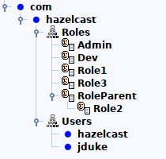

# LDAP authentication samples

This code sample shows several configurations for LDAP authentication.

The example has 3 components:
* LDAP server ([SimpleLdapServer.java](src/main/java/simpleldap/SimpleLdapServer.java))
* Hazelcast member ([Member.java](src/main/java/Member.java))
* Hazelcast client ([TimestampClient.java](src/main/java/TimestampClient.java))

The LDAP server is populated with few objects defined in the [hazelcast.com.ldif](src/main/resources/hazelcast.com.ldif) file.

The objects tree structure in the LDAP is the following:



## Configurations

In subdirectories `config-*` are sample configurations with using a system account.

In subdirectories `basic-config-*` are sample configurations without using a system account (i.e. direct LDAP bind for provided useranames is used).

## Building the project

```
mvn clean install
```

## Running the examples

Hazelcast Enterprise license has to be provided to run this sample.

```
# start LDAP server
mvn exec:java -Dexec.mainClass=simpleldap.SimpleLdapServer

# start Hazelcast member
export HZ_LICENSEKEY=YOUR_LICENSE_KEY_HERE
mvn exec:java -Dexec.mainClass=Member \
  -Dhazelcast.config=config-direct-search/hazelcast.xml

# start Hazelcast client
mvn exec:java -Dexec.mainClass=TimestampClient \
  -Dhazelcast.client.config=config-direct-search/hazelcast-client.xml

# start unauthorized Hazelcast client (if there is the configuration present)
mvn exec:java -Dexec.mainClass=TimestampClient \
  -Dhazelcast.client.config=config-direct-search/hazelcast-client-unauthorized.xml
```

Replace the `"config-direct-search"` in the commands with the name of subdirectory you want to run as an example.
