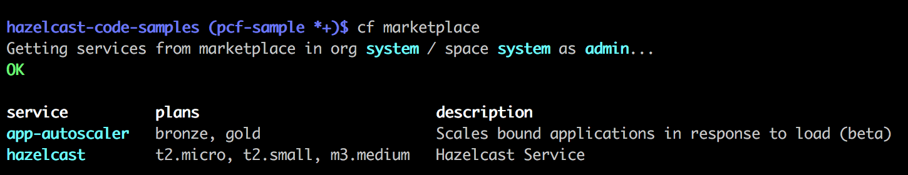
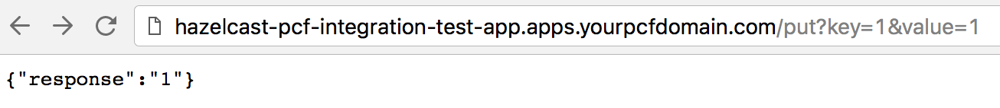
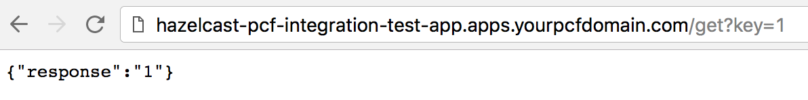

# Sample Spring Boot Application to use Hazelcast for PCF with TLS enabled

This is a sample Spring Boot application that exposes some basic Hazelcast map operations like `IMap#get`, `IMap#put`
through a RESTful Web Service interface.

Other than for TLS, this is identical to the [Sample Spring Boot Application to use Hazelcast for PCF](../../hazelcast-integration/pcf-integration/README.md).

This application uses Hazelcast Enterprise Client to connect on a TLS-secured connection to a Hazelcast cluster thats deployed on 
[Pivotal Cloud Foundry (PCF)](https://pivotal.io/platform) platform using [Hazelcast IMDG Enterprise for PCF](https://network.pivotal.io/).

## Creating a Hazelcast Cluster using Hazelcast for PCF

1) Download Hazelcast for PCF from [Pivotal Network](https://network.pivotal.io/)

2) Install Hazelcast IMDG Enterprise for PCF to your PCF setup. You can refer to Hazelcast IMDG Enterprise for PCF [documentation](https://docs.pivotal.io/partners/hazelcast/) for detailed installation instructions.

3) Check your Hazelcast installation using `cf marketplace` command. You should see "hazelcast" as a service after installation.
    

4) Create a service `cf create-service hazelcast PLAN_NAME SERVICE_NAME -c PATH_TO_hazelcast.json` command. Hazelcast IMDG Enterprise for PCF accepts configuration as JSON. You can use 
    [hazelcast.json](hazelcast.json)  provided in this project by filling the `licensekey` section with a valid license
    Please note that [hazelcast.json](hazelcast.json) has additional configuration options compared to the standard Hazelcast configuration.
    - `tlsArchiveUrl`: Provide a valid URL for a `tgz` archive containing a `truststore` file and a `keystore` file.
    - `instanceCount`: You can set number of desired Hazelcast members using this option while creating your Hazelcast service. 
    Beyond that, you can change this parameter while updating your Hazelcast service (using `cf update-service`) to dynamically 
    scale in/out your Hazelcast cluster.
    - `mancenterAppName`: This option is only meaningful when Hazelcast Management Center is enabled using below configuration.
     This has to be a unique name as this name will be registered to your PCF app domain. (i.e; http://mancenter.apps.yourpcfdomain.com)
     Note: Leave the configuration as it is if you wouldn't like to start Management Center at this point.
    ```
    ...
    "managementCenterConfig":{"enabled":true,"updateInterval":3}
    ...
    "mancenterAppName":"mancenter"
    ```

  A [hazelcast-full.json](../../hazelcast-integration/pcf-integration/hazelcast-full.json) file in this project is provided as well to show syntax for advanced settings. You can copy the relevant parts to your own config file and change the values according to your needs.

5) Check you service status using `cf services`. In our case, there are two Hazelcast services available.

    

6) Edit [Application.java](src/main/java/com/hazelcast/pcf/integration/Application.java) and provide a valid license.

    ```java
        // TODO provide valid license
        public static final String LICENSE_KEY = "YOUR_LICENSE_KEY";
    ```

7) Build and push "pcf-integration" app using [deploy-app.sh](deploy-app.sh). This file uses [manifest.yml](manifest.yml),
you can modify it according to your needs.

    ```
    applications:
    - name: hazelcast-pcf-tls
      memory: 2048M
      instances: 1
      path: target/pcf-tls-integration-0.1-SNAPSHOT.jar
      random-route: false
    ```

8) Your first push attempt will fail since it needs a Hazelcast service. 
    Bind the Hazelcast service that you've created in step 4 to your application using and restage your application;
    ```
    cf bind-service hazelcast-pcf-tls  SERVICE_NAME (i.e: micro-hazelcast-with-mancenter)
    cf restage hazelcast-pcf-tls
    ```

9) Now you can access your Hazelcast Cluster deployed on PCF using this application.
  
    A sample `IMap#put` operation:
    
    
    
    A sample `IMap#get` operation:
    
    
  


