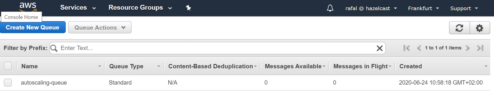
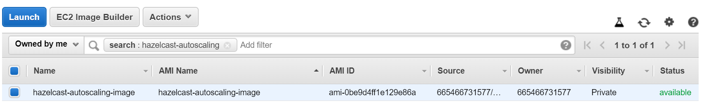
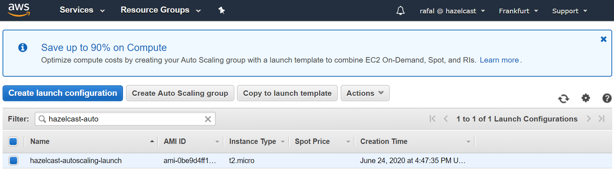
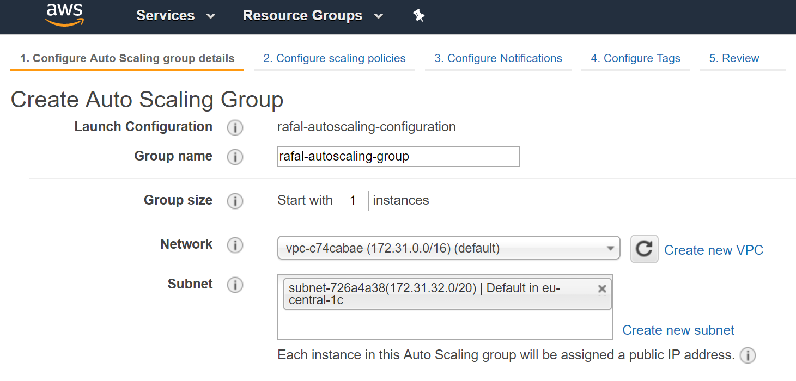
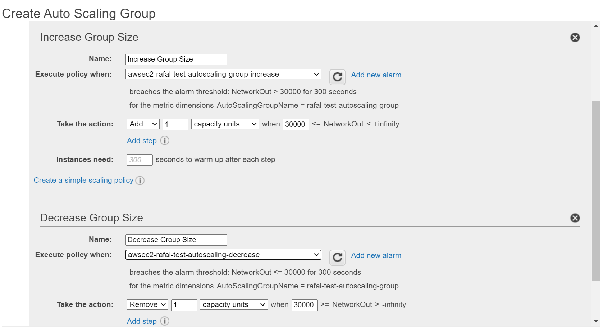
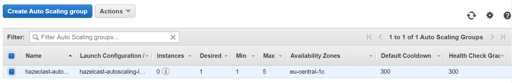
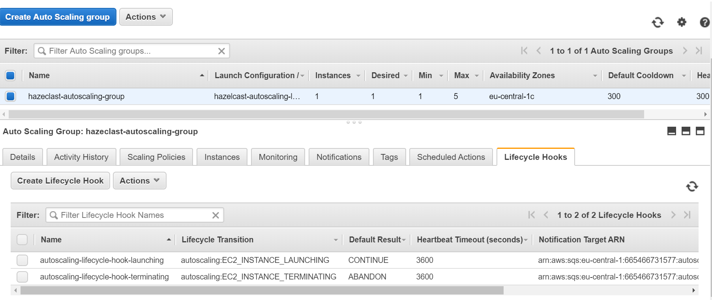

# AWS Autoscaling for Hazelcast

Hazelcast has specific requirements with regards to its AWS Autoscaling procedure. Read more [here](https://github.com/hazelcast/hazelcast-aws#aws-autoscaling). 

This code sample presents a sequence of steps which leads to a complete autoscaling Hazelcast autoscaled cluster.

### Step 1: Create Amazon SQS (Simple Queue Service)

1. Open AWS SQS console: https://eu-central-1.console.aws.amazon.com/sqs
2. Click on "Create New Queue", enter "Queue name, and click "Create Queue"
3. The queue should be visible in the console



### Step 2: Create AMI (Amazon Machine Image) with Hazelcast
1. Set up a EC2 Instance with Hazelcast:
   1. Hazelcast should run as a service (or start in the User Data script)
   1. Hazelcast needs to have the health REST endpoint enabled (property `hazelcast.http.healthcheck.enabled` set to `true`)
2. Install the necessary tool: `jq`
```
$ sudo yum install -y jq
```
3. Download [lifecycle_hook_listener.sh](lifecycle_hook_listener.sh)
```
$ wget https://raw.githubusercontent.com/hazelcast/hazelcast-code-samples/master/hazelcast-integration/aws-autoscaling/lifecycle_hook_listener.sh 
$ chmod +x lifecycle_hook_listener.sh
```
4. Configure AWS CLI
```
$ sudo aws configure
```
5. Create AMI Image from the EC2 Instance (by clicking "Image→Create Image")
6. The image should be visible in the AWS console



### Step 3: Create Autoscaling Group

1. Open AWS Autoscaling console: https://console.aws.amazon.com/awsautoscaling
2. Click on "Create Launch configuration", select "My AMI", and choose the created image
3. In the "Create Launch Configuration" step, in the "User Data" field, add a script which starts `lifecycle_hook_listener.sh`
```
#!/bin/bash
<path-to-script>/lifecycle_hook_listener.sh <queue-name>
```


4. Don't forget to set up the security group which allows traffic to the Hazelcast member
5. Click on "Create Launch Configuration", and then "Create an Auto Scaling group using this launch configuration"
6. Enter "Group Name", "Network", and "Subnet" and click on "Next: Configure scaling policies"



7. Configure scaling policies
   1. Select "Use scaling policies to adjust the capacity of this group"
   1. Choose the max and min number of instances
   1. Select "Scale the Auto Scaling group using step or simple scaling policies"
   1. Choose (or create) alarms: for "Increase Group Size" and "Decrease Group Size"
   1. Specify to always Add and Remove 1 instance



8. Click "Review" and "Create Auto Scaling group"
9. The Autoscaling group should be visible in the AWS console



### Step 4: Create Lifecycle Hooks

1. Create IAM Role that is allowed to publish to SQS (for details, refer to AWS Lifecycle Hooks, section: "Receive Notification Using Amazon SQS")
2. Check SQS ARN in SQS console: https://console.aws.amazon.com/sqs/home
3. Create Instance Launching Hook
```
$ aws autoscaling put-lifecycle-hook --lifecycle-hook-name <launching-lifecycle-hook-name> --auto-scaling-group-name <autoscaling-group-name> --lifecycle-transition autoscaling:EC2_INSTANCE_LAUNCHING --notification-target-arn <queue-arn> --role-arn <role-arn> --default-result CONTINUE
```
4. Create Instance terminating hook
```
$ aws autoscaling put-lifecycle-hook --lifecycle-hook-name <terminating-lifecycle-hook-name> --auto-scaling-group-name <autoscaling-group-name> --lifecycle-transition autoscaling:EC2_INSTANCE_TERMINATING --notification-target-arn <queue-arn> --role-arn <role-arn> --default-result ABANDON
```
5. The lifecycle hooks should be visible in the AWS console


