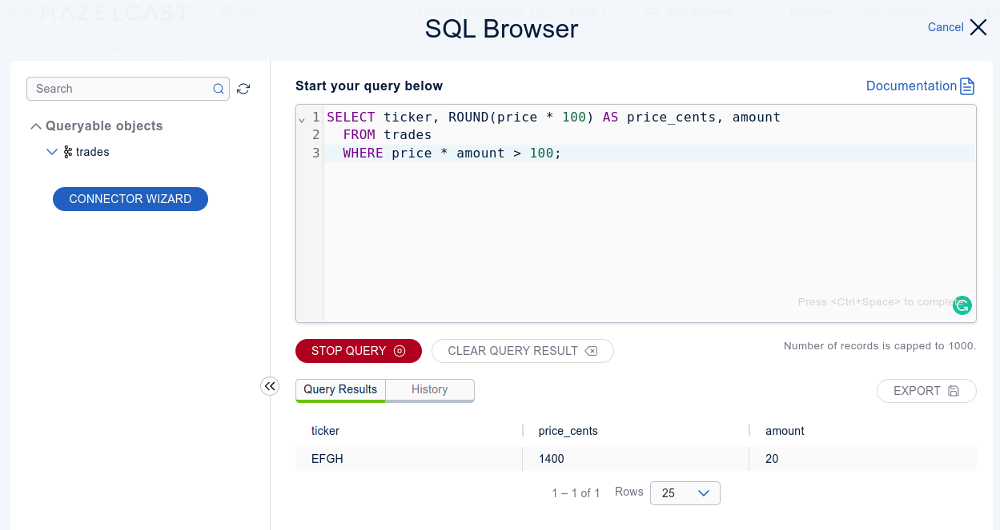

# SQL over Kerberos protected Kafka

This Docker compose example is based on the "SQL over Kafka" tutorial in the Hazelcast documentation: https://docs.hazelcast.com/hazelcast/latest/sql/learn-sql

It extends the basic scenario and configures Kerberos authentication on Kafka.

## Containers in the compose

There are the following containers started in this Docker compose:

* `zookeeper` - Zookeeper server used for Kafka service synchronization and as a naming registry
* `kafka-broker`- the Kafka broker
* `kerberos-kdc` - Simple Kerberos server / Key Distribution Center (for testing purposes only)
* `kerberos-key-material-generator` - helper container used to generate Kerberos KeyTab files
* `hazelcast` - Hazelcast member
* `management-centers` - Hazelcast management center

## Quickstart

To start all the services, run the following command in this directory:

```bash
docker compose up
```

The command will use the [`docker-compose.yml`](docker-compose.yml) file to read service configurations.

## Hazelcast SQL

You can execute SQL in the SQL Browser within the Management Center at http://localhost:8080. The username is `admin`, and the password `hazelcast12`.

You can also start the SQL console within the Hazelcast CLI in hazelcast docker container:

```bash
docker exec -it hazelcast bin/hz-cli sql
```

### Create a mapping to Kafka

To allow Hazelcast to access Kafka messages within a topic, we have to create a Hazelcast mapping.
Moreover, when Kerberos authentication is involved, SASL-related Kafka properties must be appropriately configured.

```sql
CREATE MAPPING trades (
    id BIGINT,
    ticker VARCHAR,
    price DECIMAL,
    amount BIGINT)
TYPE Kafka
OPTIONS (
    'valueFormat' = 'json-flat',
    'bootstrap.servers' = 'broker.kerberos.example:9092',
    'sasl.mechanism' = 'GSSAPI',
    'security.protocol' = 'SASL_PLAINTEXT',
    'sasl.kerberos.service.name' = 'kafka',
    'sasl.jaas.config' = 'com.sun.security.auth.module.Krb5LoginModule required useTicketCache=true useKeyTab=true storeKey=true keyTab="/mnt/jduke.keytab" principal="jduke@KERBEROS.EXAMPLE";'
);
```

See the [GSSAPI authentication](https://docs.confluent.io/platform/current/kafka/authentication_sasl/authentication_sasl_gssapi.html#clients) section in the Kafka documentation 
for more details about the security options.

The [Krb5LoginModule configuration](https://docs.oracle.com/en/java/javase/11/docs/api/jdk.security.auth/com/sun/security/auth/module/Krb5LoginModule.html) in the
`sasl.jaas.config` client property authenticates Hazelcast against the Kerberos KDC server with name `jduke@KERBEROS.EXAMPLE` and credentials stored in the keytab file `/mnt/jduke.keytab`.
Once authenticated to KDC, Hazelcast can ask KDC to issue a service ticket to access Kafka. The service principal name (SPN) is `kafka/broker.kerberos.example@KERBEROS.EXAMPLE`.

Once the SQL mapping is created we can start a streaming query

```sql
SELECT ticker, ROUND(price * 100) AS price_cents, amount
  FROM trades
  WHERE price * amount > 100;
```

And in another SQL window (SQL CLI or SQL Browser in Management Center) run some SQL inserts:

```sql
INSERT INTO trades VALUES
  (1, 'ABCD', 5.5, 10),
  (2, 'EFGH', 14, 20); 
```

You should see the filtered results in the first window:



## Test broker-only Kerberos authentication (GSSAPI)

If you want to play with Kerberos-protected Kafka without Hazelcast, you can connect to the `kafka-broker` container and run a producer and consumer there.

```bash
docker exec -it kafka-broker bash

# create topic and test producer+consumer authentication
kafka-topics --bootstrap-server broker.kerberos.example:9092 --create --topic hztest --command-config /etc/kafka/kafka-client.properties
cat /etc/passwd | kafka-console-producer --bootstrap-server broker.kerberos.example:9092 --topic hztest --producer.config /etc/kafka/kafka-client.properties
kafka-console-consumer --bootstrap-server broker.kerberos.example:9092 --topic hztest --consumer.config /etc/kafka/kafka-client.properties --from-beginning 
```
