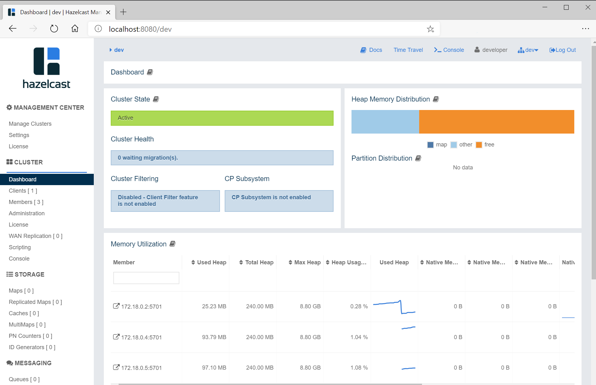

= Hazelcast cluster with Docker Compose

This guide will get you started to setting up Hazelcast cluster using Docker Compose.

== What You’ll Learn

In this guide, you'll deploy and scale Hazelcast cluster together with Hazelcast Management Center.

== Prerequisites

- ~10 minutes
- https://docs.docker.com/install/[Docker] (https://www.docker.com/products/docker-desktop[Docker for Desktop] is good enough)
- https://docs.docker.com/compose/[Docker Compose] tool

== Starting Hazelcast cluster and Management Center

Docker Compose allows you to define a multi-container application with all of its dependencies in a single file, then spin your application and dependencies up in a single command. In our case, our `docker-compose.yaml` starts two Docker containers:

- `hazelcast/hazelcast`: Hazelcast member
- `hazelcast/management-center`: Hazelcast Management Center application

To start both of them, execute the following command.

    docker-compose up -d

Two containers are started.

    $ docker-compose ps
                   Name                           Command         State             Ports
    ----------------------------------------------------------------------------------------
    docker-compose_hazelcast_1         /opt/hazelcast/start-hazel Up   0.0.0.0:32770->5701/tcp
    docker-compose_management-center_1 bash /mc-start.sh          Up   0.0.0.0:8080->8080/tcp, 8081/tcp, 8443/tcp

You can now open your browser at http://localhost:8080 and you should see the Management Center application.

image::images/mancenter.png[]

Note that Management Center displays one Hazelcast member. In the next step, we will scale it up.

== Scaling Hazelcast

To scale up the Hazelcast cluster, execute the following command.

    docker-compose scale hazelcast=3

Then, you should see that two additional containers are created.

    $ docker-compose ps
                   Name                           Command         State             Ports
    ----------------------------------------------------------------------------------------
    docker-compose_hazelcast_1         /opt/hazelcast/start-hazel Up   0.0.0.0:32770->5701/tcp
    docker-compose_hazelcast_2         /opt/hazelcast/start-hazel Up   0.0.0.0:32772->5701/tcp
    docker-compose_hazelcast_3         /opt/hazelcast/start-hazel Up   0.0.0.0:32771->5701/tcp
    docker-compose_management-center_1 bash /mc-start.sh          Up   0.0.0.0:8080->8080/tcp, 8081/tcp, 8443/tcp

The same is visible in Management Center.

== Tearing Down

To terminate the Hazelcast cluster and Management Center, execute the following command.

    docker-compose down

== Summary

In this guide, we deployed and scaled Hazelcast cluster using Docker Compose. If you want to use the cluster with Hazelcast client, then read the resources mentioned below.

== See Also

* https://hazelcast.com/blog/configuring-hazelcast-in-non-orchestrated-docker-environments/[Configuring Hazelcast in Non-Orchestrated Docker Environments]
* https://github.com/hazelcast/hazelcast-docker[Hazelcast Docker documentation]
