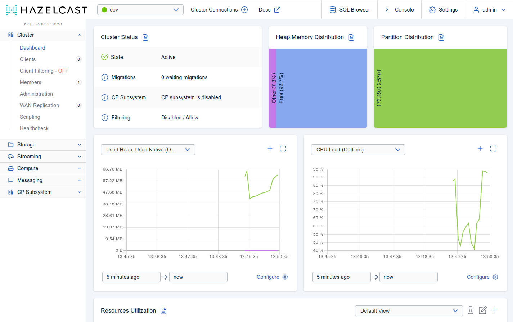

= Hazelcast cluster with Docker Compose

This guide will get you started to setting up Hazelcast cluster using Docker Compose.

== What You’ll Learn

In this guide, you'll deploy Hazelcast member together with Hazelcast Management Center.

== Prerequisites

- ~10 minutes
- https://docs.docker.com/install/[Docker] (https://www.docker.com/products/docker-desktop[Docker for Desktop] is good enough)
- https://docs.docker.com/compose/[Docker Compose] tool

== Starting Hazelcast cluster and Management Center

Docker Compose allows you to define a multi-container application with all of its dependencies in a single file, then spin your application and dependencies up in a single command. In our case, our `docker-compose.yaml` starts two Docker containers:

- `hazelcast/hazelcast`: Hazelcast member
- `hazelcast/management-center`: Hazelcast Management Center application

To start both of them, execute the following command.

    docker compose up -d

Two containers are started.

    $ docker compose ps
    NAME                                 COMMAND                  SERVICE             STATUS              PORTS
    docker-compose-hazelcast-1           "hz start"               hazelcast           running             0.0.0.0:49153->5701/tcp, :::49153->5701/tcp
    docker-compose-management-center-1   "bash ./bin/mc-start…"   management-center   running             8081/tcp, 0.0.0.0:8080->8080/tcp, :::8080->8080/tcp, 8443/tcp

You can now open your browser at http://localhost:8080 and you should see the Management Center application.

== Tearing Down

To terminate the Hazelcast cluster and Management Center, execute the following command.

    docker compose down

== Summary

In this guide, we deployed Hazelcast environment using Docker Compose. If you want to use the cluster with Hazelcast client, then read the resources mentioned below.

== See Also

* https://hazelcast.com/blog/configuring-hazelcast-in-non-orchestrated-docker-environments/[Configuring Hazelcast in Non-Orchestrated Docker Environments]
* https://github.com/hazelcast/hazelcast-docker[Hazelcast Docker documentation]
