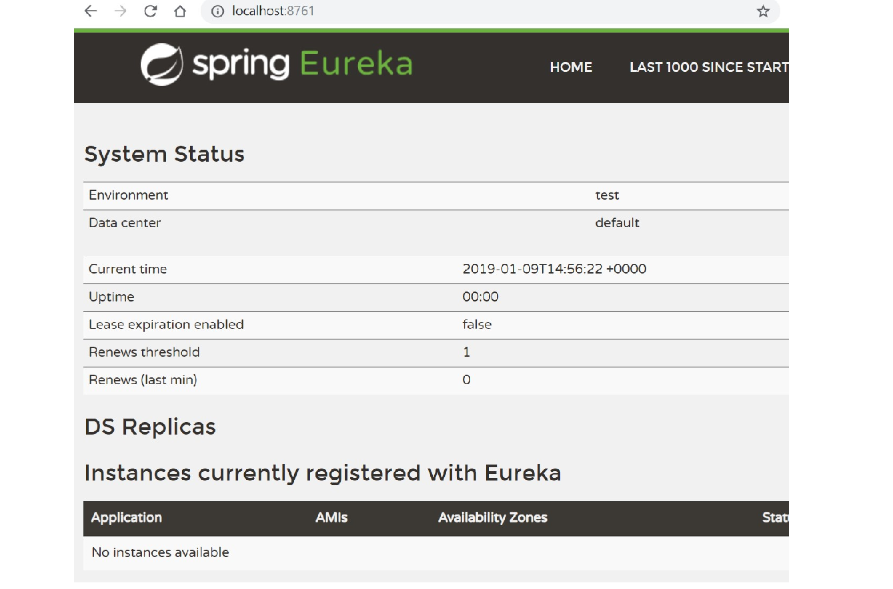

# Hazelcast Embedded with Eureka discovery

This is a sample Spring Boot application with embedded Hazelcast, which presents forming a Hazelcast cluster using the [Hazelcast Eureka plugin](https://github.com/hazelcast/hazelcast-eureka).

## Introduction

This Code Sample contains 4 projects:
 * `eureka-server` - Eureka Server (not related to Hazelcast)
 * `hazelcast-only` - Spring Boot Application which registers Hazelcast member in Eureka
 * `hazelcast-separate-client` - Spring Boot Application which registers both Hazelcast member and the Spring Boot application itself in Eureka (Hazelcast member uses a separate Eureka Client than the application)
 * `hazelcast-metadata` - Spring Boot Application which registers both Hazelcast member and the Spring Boot application itself in Eureka (Hazelcast member uses the same Eureka Client than the application)
 
 To start any interaction, you need to build all the projects with the following command.
 
    $ mvn clean package

## 1. Start Eureka server

To use Eureka discovery, you need first to start the Eureka server. Usually you would start multiple instances to provide high availability, but in this Code Sample a single localhost instance is good enough.

    $ java -jar eureka-server/target/eureka-server-0.1-SNAPSHOT.jar

You can see that Eureka Sever started correctly by opening the browser at: http://localhost:8761.



## 2.1 Hazelcast Only

The first project `hazelcast-only` presents how to use the Eureka-based Hazelcast discovery if you don't need to register your Spring Boot application at the same time.

The simplest Hazelcast configuration looks as follows.

```java
@Bean
public Config hazelcastConfig() {
    Config config = new Config();
    config.getNetworkConfig().getJoin().getMulticastConfig().setEnabled(false);
    config.getNetworkConfig().getJoin().getEurekaConfig()
          .setEnabled(true)
          .setProperty("self-registration", "true")
          .setProperty("namespace", "hazelcast");
    return config;
}
```

You also need to configure the Eureka Client specific properties in the `eureka-client.properties` file.

```properties
hazelcast.shouldUseDns=false
hazelcast.name=hazelcast-only
hazelcast.serviceUrl.default=http://localhost:8761/eureka/
```

With such configuration you can start two Spring Boot applications.

    $ java -jar hazelcast-only/target/hazelcast-only-0.1-SNAPSHOT.jar --server.port=8081 --hazelcast.port=5703
    $ java -jar hazelcast-only/target/hazelcast-only-0.1-SNAPSHOT.jar --server.port=8080 --hazelcast.port=5701

You should see in the logs that Hazelcast members formed a cluster together.

```
...
Members {size:2, ver:2} [
        Member [172.16.8.53]:5703 - 48d1ff51-f7d4-477d-aba6-05fea7ccce4c
        Member [172.16.8.53]:5701 - 800fad2b-3aaf-4f28-b944-e75572664e40 this
]
...
```

In the Eureka web console, you should see the following "HAZELCAST-ONLY" entries.


That is the simplest Eureka-based Hazelcast discovery. Sometimes, however, you need to have both your application and Hazelcast registered in Eureka.

## 2.2 Hazelcast with separate Eureka Client

If you need to have your application registered in Eureka as well, then the simplest way is to use separate Eureka clients. Then, Hazelcast is registered completely separately and it's visible in Eureka as a separate application.

To achieve this effect, your Hazelcast configuration is exactly the same as in the previous point, but you need to add the Eureka Client configuration for your Spring Boot Application. You can do it by adding `@EnableDiscoveryClient` to your `Application` class and defining the following `bootstrap.properties` file.

```properties
spring.application.name=spring-boot-application
``` 

In this case, Hazelcast will be registered under the name "HAZELCAST-SEPARATE-CLIENT" and the application will be registered under the name "SPRING-BOOT-APPLICATION".

With such configuration you can start two Spring Boot applications.

    $ java -jar hazelcast-separate-client/target/hazelcast-separate-client-0.1-SNAPSHOT.jar --server.port=8081 --hazelcast.port=5703
    $ java -jar hazelcast-separate-client/target/hazelcast-separate-client-0.1-SNAPSHOT.jar --server.port=8080 --hazelcast.port=5701
        
Hazelcast members should form a cluster together as in the previous section. You should also see two separate entries in the Eureka web console.


## 2.3 Hazelcast reusing Eureka Client (Metadata)

Sometimes, you may not want to have Hazelcast registered as a separate application in Eureka. After all, Hazelcast is not a separate application, but a library embedded inside your Spring Boot application. In that case the Eureka plugin provides a solution to store the information about Hazelcast `host` and `port` in the Metadata of the application itself, by using the same Eureka client as the application.

Change your Hazelcast configuration to include the metadata-related properties.

```java
@Bean
public Config hazelcastConfig(EurekaClient eurekaClient) {
    EurekaOneDiscoveryStrategyFactory.setEurekaClient(eurekaClient);
    Config config = new Config();
    config.getNetworkConfig().getJoin().getMulticastConfig().setEnabled(false);
    config.getNetworkConfig().getJoin().getEurekaConfig()
          .setEnabled(true)
          .setProperty("self-registration", "true")
          .setProperty("namespace", "hazelcast")
          .setProperty("use-metadata-for-host-and-port", "true");
    return config;
}
```

With such configuration you can start two Spring Boot applications.

    $ java -jar hazelcast-metadata/target/hazelcast-metadata-0.1-SNAPSHOT.jar --server.port=8081 --hazelcast.port=5703
    $ java -jar hazelcast-metadata/target/hazelcast-metadata-0.1-SNAPSHOT.jar --server.port=8080 --hazelcast.port=5701
        
Hazelcast members should form a cluster together as in the previous section. You should also see two separate entries in the Eureka web console.


## 3. Verifying the configuration

No matter which configuration you followed, you should have your Hazelcast cluster formed. Each Hazelcast instance is embedded into a web service with a few endpoints dedicated to operate on the Hazelcast data. We’ll use two of these endpoints to check that Hazelcast works correctly:
* `/put`: inserts a key-value entry into Hazelcast
* `/get`: reads a value from Hazelcast by the key

Let’s first insert a key-value entry into the first web service.

    $ curl http://localhost:8080/put?key=some-key\&value=some-value

Then, we can read the value from the second web service.

    $ curl http://localhost:8081/get?key=some-key
    {"response":"some-value"}

We received the expected value from the second service, which means that the services work correctly and that the embedded Hazelcast instances formed a cluster together.
