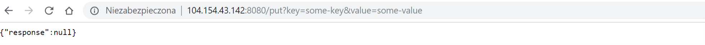
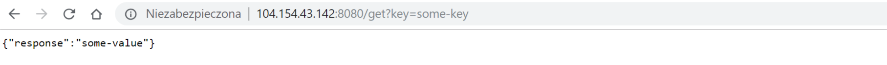

# Hazelcast embedded on Kubernetes

This is a sample Spring Boot application with embedded Hazelcast, which presents forming a Hazelcast cluster on Kubernetes.

This sample uses Kubernetes API for Hazelcast member discovery.

## 1. Configure Hazelcast to work on Kubernetes

You can configure Hazelcast to work on Kubernetes using the [hazelcast-kubernetes](https://github.com/hazelcast/hazelcast-kubernetes) plugin.

Add the following Maven dependencies:
```xml
<dependency>
    <groupId>com.hazelcast</groupId>
    <artifactId>hazelcast</artifactId>
    <version>3.11</version>
</dependency>
<dependency>
    <groupId>com.hazelcast</groupId>
    <artifactId>hazelcast-kubernetes</artifactId>
    <version>1.3.1</version>
</dependency>
```

Then, configure the Kubernetes Discovery Strategy. You can do it in two different manners: Java-based configuration or XML configuration. In this code sample, we used the first approach:
```java
public Config hazelcastConfig() {
    Config config = new Config();
    JoinConfig joinConfig = config.getNetworkConfig().getJoin();
    joinConfig.getMulticastConfig().setEnabled(false);
    joinConfig.getKubernetesConfig().setEnabled(true);
    return config;
}
``` 

The equivalent XML configuration would look as follows:
```xml
<?xml version="1.0" encoding="UTF-8"?>
<hazelcast xmlns="http://www.hazelcast.com/schema/config" xmlns:xsi="http://www.w3.org/2001/XMLSchema-instance" xsi:schemaLocation="http://www.hazelcast.com/schema/config hazelcast-config-3.11.xsd">
  <network>
    <join>
      <multicast enabled="false"/>
      <kubernetes enabled="true"/>
    </join>
  </network>
</hazelcast>
```

Note that this configuration will form a Hazelcast with all Hazelcast instances assigned to services in the current namespace. If you want to filter the instances, use the properties as described [here](https://github.com/hazelcast/hazelcast-kubernetes).

## 2. Build application and Docker image

The following command compiles the project, builds the Docker image, and pushes it into your Docker Hub account.

```bash
mvn clean compile jib:build -Dimage=leszko/hazelcast-kubernetes-embedded-sample
```

Please change `leszko` to your Docker Hub login. Then, make sure that your image in Docker Hub is public (you can do it on the [Docker Hub website](https://hub.docker.com/)).

## 3. Grant access to Kubernetes API

In order for the POD to use Kubernetes API, you need to create the given Role Binding.

```bash
kubectl apply -f rbac.yaml
```

## 4. Deploy application

Update `deployment.yaml` with the image you pushed to Docker Hub. Then, to deploy an application, run the following command:

```bash
kubectl apply -f deployment.yaml
```

## 5. Verify that Application works correctly

You can check that the Deployment and Service were created.

```
$ kubectl get all
NAME                                      READY     STATUS    RESTARTS   AGE
pod/hazelcast-embedded-57f84c545b-64tnk   1/1       Running   0          2m
pod/hazelcast-embedded-57f84c545b-jjhcs   1/1       Running   0          45s

NAME                         TYPE           CLUSTER-IP      EXTERNAL-IP      PORT(S)                         AGE
service/hazelcast-embedded   LoadBalancer   10.19.251.145   104.154.43.142   5701:32302/TCP,8080:31613/TCP   2m

NAME                                       DESIRED   CURRENT   UP-TO-DATE   AVAILABLE   AGE
deployment.extensions/hazelcast-embedded   2         2         2            2           2m

NAME                                                  DESIRED   CURRENT   READY     AGE
replicaset.extensions/hazelcast-embedded-57f84c545b   2         2         2         2m

NAME                                 DESIRED   CURRENT   UP-TO-DATE   AVAILABLE   AGE
deployment.apps/hazelcast-embedded   2         2         2            2           2m

NAME                                            DESIRED   CURRENT   READY     AGE
replicaset.apps/hazelcast-embedded-57f84c545b   2         2         2         2m
```

In the logs for PODs, you should see that the Hazelcast members formed a cluster.

```
$ kubectl logs pod/hazelcast-embedded-57f84c545b-jjhcs
 ...
 Members {size:2, ver:4} [
         Member [10.16.2.6]:5701 - 33076b61-e99d-46f2-b5c1-35e0e75f2311
         Member [10.16.2.8]:5701 - 9ba9bb61-6e34-460a-9208-c5a644490107 this
 ]
 ...
```

Then, you can access the application, by its `EXTERNAL-IP`.




