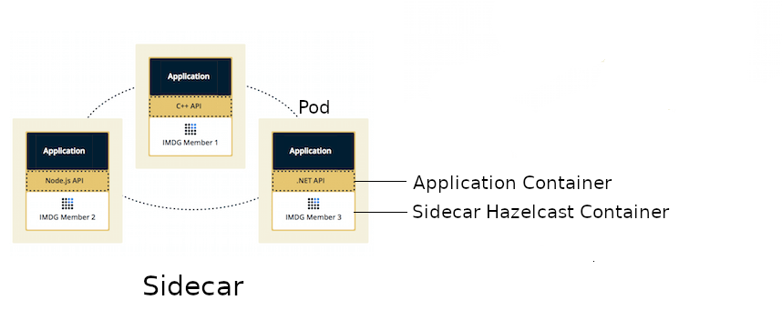

# Hazelcast as Sidecar container

This is a complete example presenting how to use Hazelcast as a sidecar container for your applications deployed on Kubernetes.

## Introduction

Hazelcast is usually deployed using one of [two topologies](https://docs.hazelcast.org/docs/latest/manual/html-single/#hazelcast-topology):
* Embedded
* Client/Server

### Hazelcast Topologies


The **Embedded** topology is dedicated to JVM-based applications. The application itself starts a Hazelcast member, which is simple to configure. Such approach also provides low-latency data access, because Hazelcast member runs on the same machine as the application. What's more, Hazelcast scales together with your application. You can find an example of the embedded Hazelcast deployed on Kubernetes [here](../embedded).

The **Client/Server** topology, on the other hand, can be used by any programming language for which Hazelcast Client is provided ([Java, .NET, C++, Node.js, Python, Go, Scala](https://hazelcast.org/clients-languages/)). It also separates Hazelcast data from applications and let them scale separately. You can find an example of the client/server Hazelcast deployed on Kubernetes [here](../springboot-k8s-hello-world).

### Hazelcast Sidecar

Kubernetes allows to have multiple containers in one Pod, which usually means having the main application container and a so-called "sidecar" container. With such approach we can introduce a new Hazelcast topology which would place somewhere between Embedded and Client/Server.



**Sidecar** topology brings the benefits of the **Embedded** topology, because Hazelcast scales together with the application and both containers run on the same machine. However, the application can be written in any programming language, because it connects to Hazelcast member using the standard Hazelcast Client libraries. What's more, [Kubernetes Hazelcast auto-discovery](https://github.com/hazelcast/hazelcast-kubernetes) is currently implemented only for Java, but the Hazelcast Sidecar pattern makes auto-discovery available for all programming languages.  

## Step-by-step Guide

Assuming you have a running Kubernetes cluster and the `kubectl` command configured, let's create a Python-based web service with Hazelcast sidecar member.

The web service will have two endpoints:
* `/put` for putting a value into a Hazelcast distributed map
* `/get` for getting a value from a Hazelcast distributed map

Hazelcast sidecar members from all Pods will form a Hazelcast cluster together.

### 1. Create Python Application

You can find the Python web service application (written with the Flask framework) in the [app.py](app.py) file. The most interesting part is the connection to the Hazelcast member.

```python
config = hazelcast.ClientConfig()
config.network_config.addresses.append("127.0.0.1:5701")
hazelcastClient = hazelcast.HazelcastClient(config)
``` 

We connect to `127.0.0.1`, because in Kubernetes Pod all containers share the same network layer. Thanks to that, we can always depend on the fact that the Hazelcast member is running at `localhost`.

Then, in the endpoint controller, we simply use the `hazelcastClient` as we always do.
```python
map = hazelcastClient.get_map("map")
value = map.get(key)
```

### 2. Dockerize Python Application

In the provided [Dockerfile](Dockerfile) we install `Flask` and `hazelcast-client-python` Python packages. Then, we start the application on the default Flask port (5000).

You can build Docker image for the application and push it into your Docker Hub (change `leszko` to your Docker Hub account).
```bash
$ docker build -t leszko/hazelcast-python-client .
$ docker push leszko/hazelcast-python-client 
```

**Note**: If you don't have a Docker Hub account or you don't want to use it, you can do one of the followings:
 * Use `leszko/hazelcast-python-client` in all further steps
 * Build image with your Kubernetes-related Docker host (then you don't need to push it):
   * If you use Docker Desktop, then your local image is already accessible to Kubernetes
   * If you use Minikube, then you need to execute `eval $(minikube docker-env)` before building the image
   * If you use Kubernetes from a Cloud platform, then you need to upload the image to their registry 

### 3. Create Sidecar Deployment

The next step is to configure Python application container and Hazelcast member container to exist in the same Kubernetes Pod. We do in [deployment.yaml](deployment.yaml).

```yaml
containers:
  - name: hazelcast
    image: hazelcast/hazelcast:3.12
    ports:
    - name: hazelcast
      containerPort: 5701
    ...
  - name: app
    image: leszko/hazelcast-python-client
    ports:
    - name: app
      containerPort: 5000
```

Apart from that, we configure the deployment to have 2 Pod replicas and a `NodePort` service to expose the Python application.

### 4. Deploy Sidecar Application

Before running the deployment, we need to configure RBAC (needed for Hazelcast container to make calls to Kubernetes API) and store Hazelcast configuration in ConfigMap.

```bash
$ kubectl apply -f rbac.yaml
$ kubectl apply -f config.yaml
```

Finally, we can deploy our application with the sidecar Hazelcast member.

```bash
$ kubectl apply -f deployment.yaml
```

### 5. Verify Sidecar Application

You should see 2 Pods, each having 2 containers (`hazelcast` ans `app`).

```bash
$ kubectl get pods
NAME                  READY   STATUS    RESTARTS   AGE
hazelcast-sidecar-0   2/2     Running   2          1m
hazelcast-sidecar-1   2/2     Running   2          1m
```

We can check that Hazelcast members formed a cluster.

```bash
$ kubectl logs hazelcast-sidecar-0 hazelcast
...
Members {size:2, ver:2} [
        Member [10.16.2.9]:5701 - 429dc103-310e-44f1-a0e4-7a7b958cfde6
        Member [10.16.1.10]:5701 - 099ecbb8-0f75-4b94-84c3-4ef235e4f365 this
]
```

You can also check that the Python application connected correctly to the Hazelcast cluster.

```bash
$ kubectl logs hazelcast-sidecar-0 app
...
Members [2] {
        Member [10.16.1.10]:5701 - 099ecbb8-0f75-4b94-84c3-4ef235e4f365
        Member [10.16.2.9]:5701 - 429dc103-310e-44f1-a0e4-7a7b958cfde6
}
...
 * Running on http://0.0.0.0:5000/ (Press CTRL+C to quit)
```

Finally, we can check the NodePort Service IP and Port and insert some data using `/put` and `/get` endpoints.

To check `<NODE-PORT>`, run the following command.

```bash
$ kubectl get service hazelcast-sidecar
NAME                TYPE       CLUSTER-IP     EXTERNAL-IP  PORT(S)         AGE
hazelcast-sidecar   NodePort   10.19.247.87   <none>       5000:32470/TCP  4m
```

In our case `<NODE-PORT>` is `32470`.

Checking `<NODE-IP>` depends on your Kubernetes:
* In case of Docker Desktop, it's `localhost`
* In case of Minikube, check it with `minikube ip`
* In case of Cloud platforms (and on-premise), check it with: `kubectl get nodes -o jsonpath='{ $.items[*].status.addresses[?(@.type=="ExternalIP")].address }'`

Let's insert some data and then read it.

```bash
$ curl <NODE-IP>:<NODE-PORT>/put?key=someKey\&value=someValue
$ curl <NODE-IP>:<NODE-PORT>/get?key=someKey
someValue
```

## Conclusion

Hazelcast can be used as a sidecar in the Kubernetes ecosystem. Such approach can help in a number of use cases:
* Kubernetes Hazelcast **auto-discovery** for **non-JVM languages**
* **Emulating Embedded mode** for **non-JVM languages** (low latency, auto-scaling)
* **Consistent configuration** between Sidecar and Client/Server topologies (no difference in the code, only in Kubernetes YAML files)
* Clear **isolation** of Hazelcast and the application, but still having the benefits of the Embedded topology