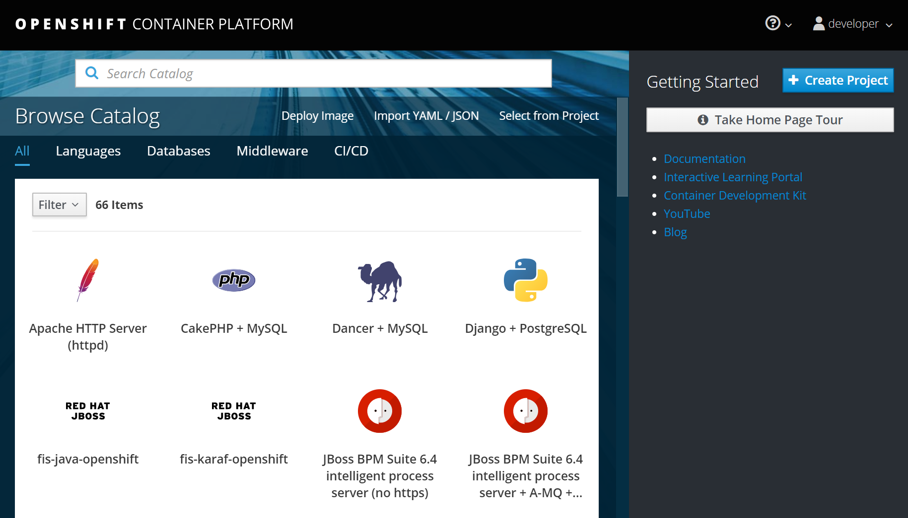
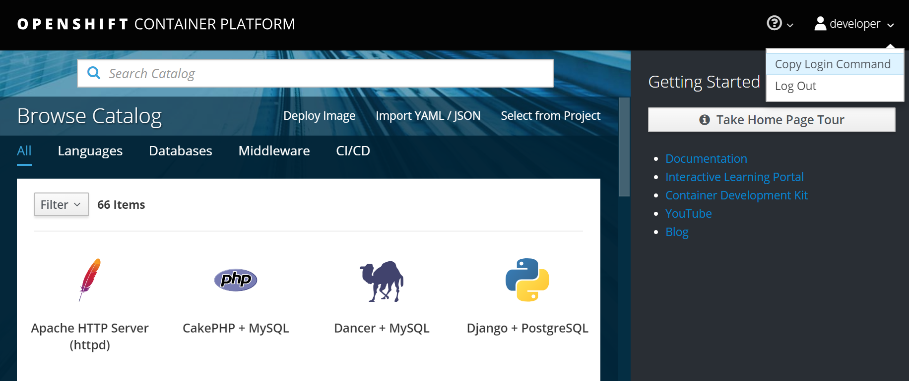
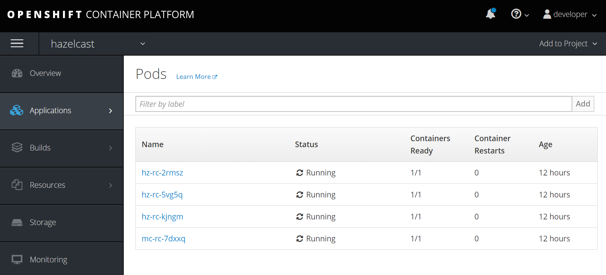
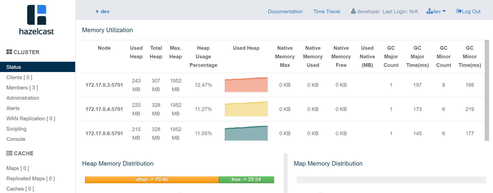
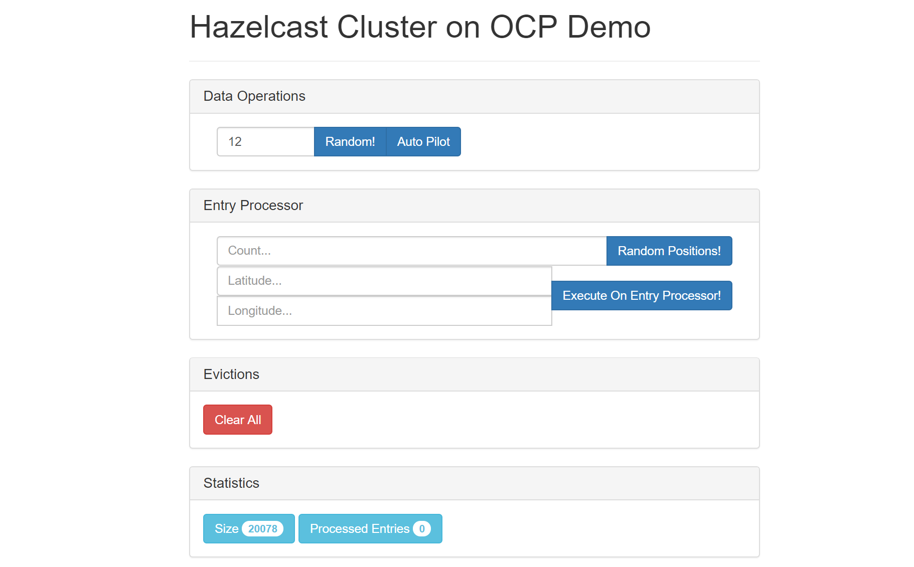
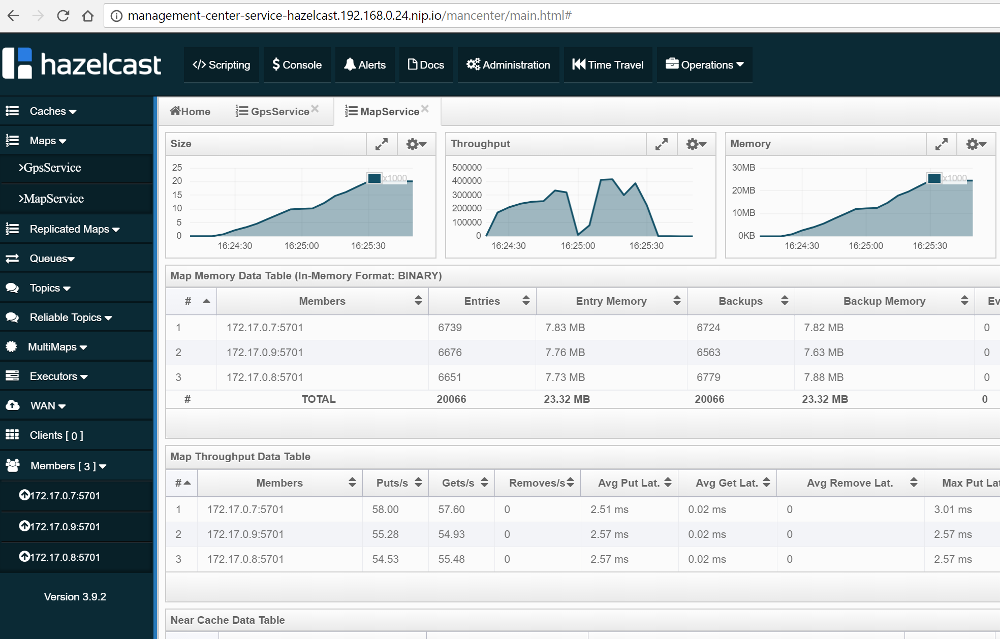
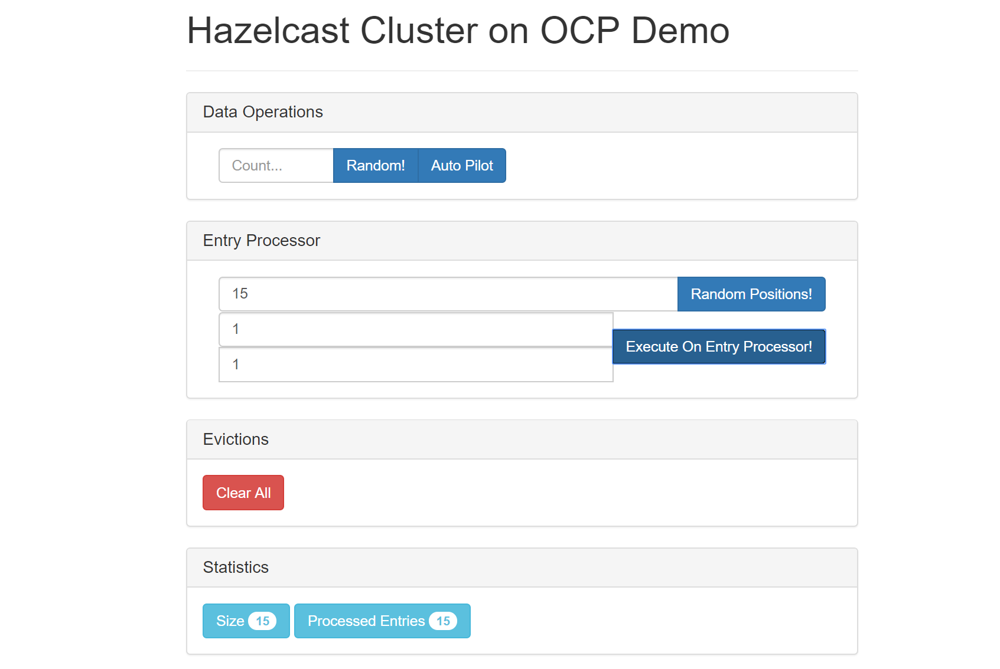
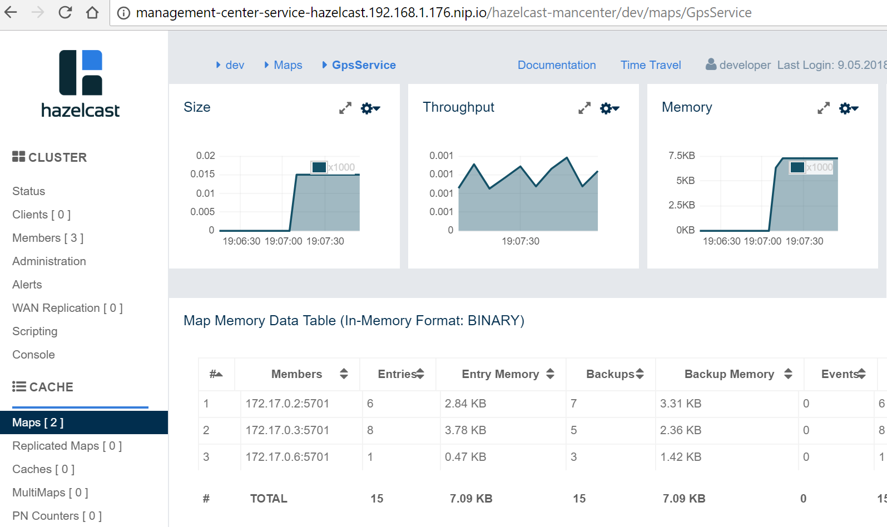

# Hazelcast for OpenShift

Hazelcast can be used as a Caching Layer for applications deployed on [OpenShift](https://www.openshift.com/).

This sample is a complete guideline on how to set up the local OpenShift environment, start Hazelcast cluster, configure Management Center, and finally run a sample client application.

### Table of Contents
* [Step-by-step instruction](#step-by-step-instruction)
  * [Step 1: Install OpenShift environment](#step-1-install-openshift-environment)
  * [Step 2: Start Hazelcast cluster](#step-2-start-hazelcast-cluster)
  * [Step 3: Access Management Center](#step-3-access-management-center)
  * [Step 4: Run a sample Hazelcast client application](#step-4-run-a-sample-hazelcast-client-application)
* [Authenticate to Red Hat Container Catalog](#authenticate-to-red-hat-container-catalog)
* [External Hazelcast Client](#external-hazelcast-client)
* [Debugging](#debugging)

# Step-by-step instruction

## Step 1: Install OpenShift environment

There are multiple options to run the OpenShift environment:
 * [Minishift](https://www.openshift.org/minishift/): local OpenShift deployed on Virtual Machine
 * [OpenShift Online](https://www.openshift.com/products/online/): Red Hat's cloud platform
 * [OpenShift installed on AWS](https://github.com/aws-quickstart/quickstart-redhat-openshift)
 * OpenShift installed on any other cloud platform or a dedicated server

**Note**: This guide can be followed on any environment, however some of the steps differ, for example, accessing Persistent Storage. What's more, some of the steps are not possible to execute on certain environments, for example, connecting with external client to the Hazelcast deployed on OpenShift Online (since it does not provide public IPs). In such cases, the Minishift solution is presented, because Minishift is free and simple to start from.

Minishift toolkit (version 3.3.0) is used to help with running OpenShift locally. Use the following steps to set it up:

1) Install OpenShift Container Development Kit (CDK) as described [here](https://developers.redhat.com/products/cdk/download/)
2) Configure CDK and run a first Hello World OpenShift application as described [here](https://developers.redhat.com/products/cdk/hello-world/)

    The Red Hat guide is complete in general, however here are a few **hints** that can save your time:
    * Complete the "Setup" section before you run `minishift setup-cdk`
    * In case of any issues with Minishift, you can enable fine level logging with the option `--show-libmachine-logs -v5`
    * In case of using Windows and Hyper-V:
      * In one of the points you need to create the virtual switch, you can use [this guide](https://docs.microsoft.com/en-us/windows-server/virtualization/hyper-v/get-started/create-a-virtual-switch-for-hyper-v-virtual-machines) to do it; then the name of the created switch is the one you need to use instead of "External (Wireless)"
      * Make sure to [add user to Hyper-V Administrator group](https://blogs.msdn.microsoft.com/virtual_pc_guy/2016/05/30/adding-yourself-to-the-hyper-v-administrators-group-with-powershell/)
      * Hyper-V does not well support NAT networks, so your router must accept the Virtual Machine connecting directly to the same network interface (in case of problems, you may see a meaningless error `Too many retries waiting for SSH to be available`); the solution is to use VirutalBox instead of Hyper-V or play with the [experimental Minishift features](https://docs.openshift.org/latest/minishift/using/experimental-features.html)


3) Make sure your `minishift` and `oc` tools are installed and ready to use

```
$ minishift version
minishift v1.11.0+d7f374a
CDK v3.3.0-1

$ oc version
oc v3.9.0-alpha.3+78ddc10
kubernetes v1.9.1+a0ce1bc657
features: Basic-Auth
```

4) Make also sure that you're able to access the OpenShift Web Console.

```
$ minishift console
```

Log in as Username: "developer", Password: "developer".




## Step 2: Start Hazelcast cluster

Note that, in case of Hazelcast Enterprise OpenShift (both [Centos](hazelcast-cluster/hazelcast-enterprise-openshift-centos/) and [RHEL](hazelcast-cluster/hazelcast-enterprise-openshift-rhel/), you will need a valid Hazelcast license key. If you don't have one, you can either use [Hazelcast OpenShift Origin](hazelcast-cluster/hazelcast-openshift-origin/) instead or get a trial key from [this link](https://hazelcast.com/hazelcast-enterprise-download/trial/).

**1) Create Project**

Log into OpenShift Platform. The login command is available when you click in the Web Console: "Copy Login Command".



```
$ oc login https://192.168.1.176:8443 --token=OnqI91DRdpni6ChmpMDwsRkGd5cjkmXKp7xKsI7u8QE
```

Then, you can create a new project.
```
$ oc new-project hazelcast
```

Note that, in case of [Hazelcast Enterprise OpenShift RHEL](hazelcast-cluster/hazelcast-enterprise-openshift-rhel/), you will need to authenticate to Red Hat Container Catalog as described [here](#authenticate-to-red-hat-container-catalog).

**2) Start Hazelcast cluster**

Change the directory to Hazelcast Enterprise (`$ cd hazelcast-cluster/hazelcast-enterprise-openshift-centos`), Hazelcast Enterprise RHEL (`$ cd hazelcast-cluster/hazelcast-enterprise-openshift-rhel`) or Hazelcast (`$ cd hazelcast-cluster/hazelcast-openshift-origin`).

Then, start the cluster with the following command.

```
$ oc new-app -f hazelcast.yaml \
  -p NAMESPACE=$(oc project -q) \
  -p ENTERPRISE_LICENSE_KEY=<hazelcast_enterprise_license>
```

Used parameters:
* `NAMESPACE`: must be the same as the OpenShift project's name
* `ENTERPRISE_LICENSE_KEY`: Hazelcast Enterprise License (not needed for [Hazelcast OpenShift Origin](hazelcast-cluster/hazelcast-openshift-origin/))

**3) Check that Hazelcast is running**

To check all created OpenShift resources, use the following command.

```
$ oc get all
NAME                       DESIRED   CURRENT   UP-TO-DATE   AVAILABLE   AGE
deploy/management-center   1         1         1            1           7m

NAME                              DESIRED   CURRENT   READY     AGE
rs/management-center-3761922137   1         1         1         7m

NAME                       DESIRED   CURRENT   UP-TO-DATE   AVAILABLE   AGE
deploy/management-center   1         1         1            1           7m

NAME                     DESIRED   CURRENT   AGE
statefulsets/hazelcast   3         3         7m

NAME                                    READY     STATUS    RESTARTS   AGE
po/hazelcast-0                          1/1       Running   0          7m
po/hazelcast-1                          1/1       Running   0          6m
po/hazelcast-2                          1/1       Running   0          5m
po/management-center-3761922137-kc6nx   1/1       Running   0          7m

NAME                            TYPE        CLUSTER-IP   EXTERNAL-IP   PORT(S)    AGE
svc/hazelcast-service           ClusterIP   None         <none>        5701/TCP   7m
svc/management-center-service   ClusterIP   None         <none>        8080/TCP   7m
```

Please check that the `STATUS` is `Running` for all PODs. Then, to check the logs for each replica, use the following command:

```
$ oc logs po/hazelcast-2

...
Kubernetes Namespace: hazelcast
Kubernetes Service DNS: hazelcast-service.hazelcast.svc
########################################
# RUN_JAVA=
# JAVA_OPTS=
# CLASSPATH=/data/hazelcast/*:/opt/hazelcast/*:/opt/hazelcast/external/*:
########################################
...
Members [3] {
        Member [172.17.0.3]:5701 - b047e291-ebd6-4edc-8b9c-d06fcb3b9965
        Member [172.17.0.4]:5701 - f5e6cf50-d83a-42c5-b152-2571a929fd12
        Member [172.17.0.2]:5701 - a50f8468-0852-45d2-966a-74301e04d45e this
}
...

```

Note that you can also perform all the operations and observe the results in the OpenShift Web Console.



**4) Delete Hazelcast cluster**

If you want to delete all resources (Replication Controller, Service, PODs, Storage, Config Map), you could use the following commands:

```
$ oc delete all --all
$ oc delete pvc --all
$ oc delete configmap --all
```

## Step 3: Access Management Center

Management Center application (Hazelcast Enterprise only) is already started together with Hazelcast members when using `hazelcast.yaml`. Nevertheless, in order to make it usable, you need to expose its service.

```
$ oc expose svc/management-center-service
```

Then, it's accessible via the exposed route, which you can check by:
```
$ oc get route
NAME                        HOST/PORT                                                  PATH      SERVICES                    PORT      TERMINATION   WILDCARD
management-center-service   management-center-service-hazelcast.192.168.1.113.nip.io             management-center-service   8080                    None
```

Then, you can access Management Center by opening `management-center-service-hazelcast.192.168.1.113.nip.io/hazelcast-mancenter` (`/mancenter` for versions prior to 3.10) in your browser.



## Step 4: Run a sample Hazelcast client application

If you're interested not only in setting up the Hazelcast cluster, but also in using it in the client application, you can follow the following guidelines.

Note that OpenShift sample uses the [fabric8](https://fabric8.io/) maven plugin to build Docker image. Fabric8 requires 3.3.x or higher maven version, therefore make sure that you have proper maven version installed on your machine.

Note also that the commands below are presented for the Minishift, because they use access to the Docker Registry provided with OpenShift. In case of OpenShift Online (in which you don't have access to the OpenShift's Docker Registry), you may use an external registry (for example, [Docker Hub](https://hub.docker.com/)).

**1) Build Maven dependencies**

Make sure you're in the main `openshift` directory and install the snapshot JAR files from the root directory:
```
$ mvn -f ../../pom.xml clean install
```

**2) Build "ocp-demo-frontend" Docker image**

Note that in order to build the Docker image, you need to have your OpenShift Docker Engine configured. In case of Minishift, you can do it using the guidelines from the `minishift docker-env` command, so in case of Unix-based systems:

```
$ eval $(minishift docker-env)
```

Run the following command to build the Docker image:
```
$ mvn -f client-apps/ocp-demo-frontend/pom.xml fabric8:build
```

**3) Push Docker image to the local OpenShift registry**

Check if your image is already in the OpenShift registry.

```
$ oc get is
NAME                DOCKER REPO                                   TAGS      UPDATED
ocp-demo-frontend   172.30.1.1:5000/hazelcast/ocp-demo-frontend   latest    39 seconds ago
```

In case you see the message `No resources found`, you need to manually push the image with the following commands:
```
$ docker login -u developer -p $(oc whoami -t) $(minishift openshift registry)
$ docker tag client-apps/ocp-demo-frontend $(minishift openshift registry)/$(oc project -q)/ocp-demo-frontend
$ docker push $(minishift openshift registry)/$(oc project -q)/ocp-demo-frontend
```

Then, you should see `oc-demo-frontend` in the output for `$ oc get is`.

**4) Start "ocp-demo-frontend" application**

To start the application, use the following command:
```
$ oc new-app --image-stream=ocp-demo-frontend --name=hazelcast-client-app
```

You can check that the application is running correctly:
```
$ oc get all -l app=hazelcast-client-app
NAME                                     REVISION   DESIRED   CURRENT   TRIGGERED BY
deploymentconfigs/hazelcast-client-app   1          1         1         config,image(ocp-demo-frontend:latest)

NAME                              READY     STATUS    RESTARTS   AGE
po/hazelcast-client-app-1-rcrfx   1/1       Running   0          2m

NAME                        DESIRED   CURRENT   READY     AGE
rc/hazelcast-client-app-1   1         1         1         2m

NAME                       TYPE        CLUSTER-IP      EXTERNAL-IP   PORT(S)                      AGE
svc/hazelcast-client-app   ClusterIP   172.30.64.173   <none>        8080/TCP,8778/TCP,9779/TCP   2m
```

**5) Expose the application**

In order to make the application accessible from outside the OpenShift environment, you need to expose it using the following command:
```
$ oc expose svc/hazelcast-client-app
```

Then, you should be able to access the application via the exposed route. You can check the route using the following command:

```
$ oc get routes
NAME                   HOST/PORT                                             PATH      SERVICES               PORT       TERMINATION   WILDCARD
hazelcast-client-app   hazelcast-client-app-hazelcast.192.168.2.123.nip.io             hazelcast-client-app   8080-tcp                 None
```

Now, if you open in the browser `hazelcast-client-app-hazelcast.192.168.2.123.nip.io`, you should see the following home screen.



You can check that the application really works together with the Hazelcast cluster by doing some operation in the application, for example, entering "12" in the "Data Operations->Count" and clicking "Auto Pilot". Then, in the Management Center application, you should see that the entries are added.



**6) Enable Entry Processor**

If you want to play with "Entry Processor" from the code sample, you need to place the Entry Processor JAR into the `/data` directory of Hazelcast. Currently, you use ConfigMap with `hazelcast.xml` as the volume mounted to `/data`. However, if we want to copy the custom JAR, you need to change it and use OpenShift Persistent Volume.

Let's first change the directory to Hazelcast Enterprise (`$ cd hazelcast-cluster/hazelcast-enterprise-openshift-centos`), Hazelcast Enterprise RHEL (`$ cd hazelcast-cluster/hazelcast-enterprise-openshift-rhel`) or Hazelcast (`$ cd hazelcast-cluster/hazelcast-openshift-origin`).

Then, replace ConfigMap with the Persistent Storage.

```
oc volume rc/hz-rc --add --overwrite --claim-size 1Gi --mount-path /data/hazelcast
```

Now, copy `hazelcast.xml` and `ocp-entry-processor-0.1-SNAPSHOT.jar` into the volume. In case of Minishift, you need to first check the volume name.

```
$ oc get pvc
NAME        STATUS    VOLUME    CAPACITY   ACCESS MODES   STORAGECLASS   AGE
pvc-6qrqc   Bound     pv0090    100Gi      RWO,ROX,RWX                   1h
```

The volume name is `pv0090` and the following commands copy the necessary files.

```
$ scp -i $HOME/.minishift/machines/minishift/id_rsa hazelcast-configuration/hazelcast.xml docker@$(minishift ip):/mnt/sda1/var/lib/minishift/openshift.local.pv/pv0090/
$ scp -i $HOME/.minishift/machines/minishift/id_rsa ../../client-apps/ocp-entry-processor/target/ocp-entry-processor-0.1-SNAPSHOT.jar docker@$(minishift ip):/mnt/sda1/var/lib/minishift/openshift.local.pv/pv0090/
```

Short explanation of the commands above:
* `$HOME/.minishift/machines/minishift/id_rsa` - ssh key to Minishift VM is stored in the Minishift's home directory
* `hazelcast.xml` - custom configuration of Hazelcast
* `minishift ip` - command to return the IP address of the Minishift VM
* `/mnt/sda1/var/lib/minishift/openshift.local.pv/pv0090/` - location of the Persistent Volume `pv0090` in Minishift VM

Then, after restarting all PODs (delete them, they will automatically start again), you can play with "Entry Processor".

```
oc delete po --all
```



The results should be visible in Management Center.



# Authenticate to Red Hat Container Catalog

**NOTE**: Executing the following commands requires `oc` in version `3.9` or higher!

The `hazelcast-cluster/hazelcast-enterprise-openshift-rhel/hazelcast.yaml` uses images from [Red Hat Container Catalog](https://access.redhat.com/containers/), which requires setting Red Hat credentials. In order to do it, you need to execute the following command after creating the OpenShift project.

```
$ oc create secret docker-registry rhcc \
   --docker-server=registry.connect.redhat.com \
   --docker-username=<red_hat_username> \
   --docker-password=<red_hat_password> \
   --docker-email=<red_hat_email>
$ oc secrets link default rhcc --for=pull
```

# External Hazelcast Client

Client application presented in this tutorial works only if deployed inside the OpenShift environment, because Kubernetes Discovery SPI does not support external clients. If you need to connect to the Hazelcast cluster deployed on OpenShift, then you can expose a service with `externalIP` and connect to the cluster with Smart Routing disabled.

**Note**: Your OpenShift environment needs to provide public IP addresses, so for example, the solution won't work on the OpenShift Online environment.

You can create a service with automatically assigned external IP and port.

```
$ oc expose rc hz-rc --type=LoadBalancer --name=hazelcast-ingress
```

The following command checks the external port under which the service is published.

```
$ oc get service hazelcast-ingress -o custom-columns=EXTERNAL_PORT:.spec.ports[0].nodePort
EXTERNAL_PORT
31296
```

Then, it's possible to access the Hazelcast cluster using server's public IP and that port. In case of Minishift, you can check its IP by:

```
$ minishift ip
192.168.1.176
```

Finally, you can connect to the cluster with the following Java client code:

```java
public class Client {
    public static void main(String[] args) throws Exception {
        ClientConfig clientConfig = new ClientConfig();
        clientConfig.getNetworkConfig().setSmartRouting(false);
        clientConfig.getNetworkConfig().addAddress("192.168.1.176:31296");
        HazelcastInstance client = HazelcastClient.newHazelcastClient(clientConfig);
        IMap map = client.getMap("test-map");
        map.put("testKey", "testValue");
        client.shutdown();
    }
}
```

# Debugging

Debugging containerized applications in the OpenShift cluster can be difficult. In order to attach to the running POD, you can use the following command:

```
oc exec -ti <pod_name> -- bash
```
