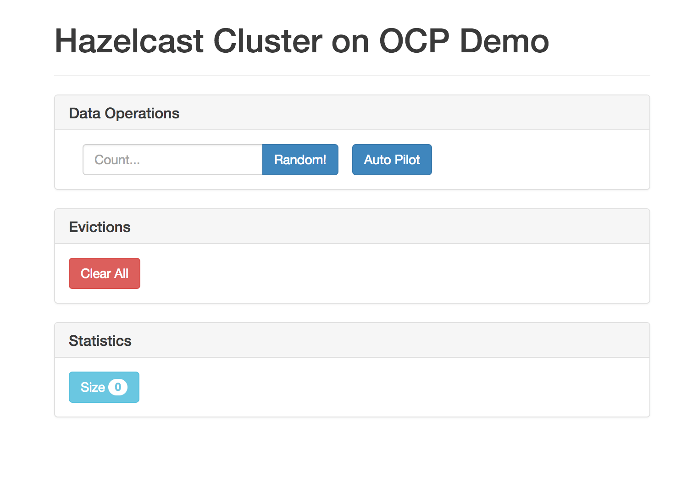

# Hazelcast client application on OpenShift
 
 This is a sample application that shows how to use Hazelcast client within OpenShift Container Platform.

### Table of Contents
- [Prerequisites](#prerequisites)
- [Step-by-step instruction](#step-by-step-instruction)
- [Troubleshooting](#troubleshooting)

# Prerequisites

Note that OpenShift sample uses the [fabric8](https://fabric8.io/) maven plugin to build Docker image. Fabric8 requires 3.3.x or higher maven version, therefore make sure that you have proper maven version installed on your machine.

Note also that in order to build the Docker image, you need to have your OpenShift Docker Engine configured. In case of Minishift, you can do it (as described [here](../#local-docker-images)) using the guidelines from the following command:

```
$ minishift docker-env
```

# Step-by-step instruction

**1) Build Maven dependencies**

Compile and build the snapshot JAR files for all projects with the following command on the project root:
```
$ mvn clean install
```

**2) Build "ocp-demo-frontend" Docker image**

Traverse to the `ocp-demo-frontend` directory, and execute the following command:
```
$ mvn fabric8:build
```

You can check that the Docker image was created.

```
$ docker images
REPOSITORY                         TAG                           IMAGE ID            CREATED              SIZE
client-apps/ocp-demo-frontend      latest                        a7e929297f20        About a minute ago   143MB
client-apps/ocp-demo-frontend      snapshot-180322-071650-0267   a7e929297f20        About a minute ago   143MB
...
```

**3) Push Docker image to the local OpenShift registry**

First, you need to log into the registry using the following command:

```
$ docker login -u developer -p $(oc whoami -t) $(minishift openshift registry)
```

Then, you can tag the Docker image and push it into the registry.

```
$ docker tag client-apps/ocp-demo-frontend $(minishift openshift registry)/$(oc project -q)/ocp-demo-frontend
$ docker push $(minishift openshift registry)/$(oc project -q)/ocp-demo-frontend
```

You can then check that the image is available inside OpenShift:

```
$ oc get is
NAME                DOCKER REPO                                   TAGS      UPDATED
ocp-demo-frontend   172.30.1.1:5000/hazelcast/ocp-demo-frontend   latest    39 seconds ago
```

**4) Start "ocp-demo-frontend" application**

To start the application you can use the following command:
```
$ oc new-app --image-stream=ocp-demo-frontend --name=hazelcast-client-app -l name=hazelcast-client-app-1
```

You can then check that the application is running correctly:
```
$ oc get all -l name=hazelcast-client-app-1
NAME                                     REVISION   DESIRED   CURRENT   TRIGGERED BY
deploymentconfigs/hazelcast-client-app   1          1         1         config,image(ocp-demo-frontend:latest)

NAME                              READY     STATUS    RESTARTS   AGE
po/hazelcast-client-app-1-rcrfx   1/1       Running   0          2m

NAME                        DESIRED   CURRENT   READY     AGE
rc/hazelcast-client-app-1   1         1         1         2m

NAME                       TYPE        CLUSTER-IP      EXTERNAL-IP   PORT(S)                      AGE
svc/hazelcast-client-app   ClusterIP   172.30.64.173   <none>        8080/TCP,8778/TCP,9779/TCP   2m
```

**5) Expose the application**

In order to make the application accessible from outside the OpenShift environment, you need to expose it using the following command:
```
$ oc expose svc/hazelcast-client-app
```

Then, you should be able to access the application via the exposed route. You can check the route using the following command:

```
$ oc get routes
NAME                   HOST/PORT                                             PATH      SERVICES               PORT       TERMINATION   WILDCARD
hazelcast-client-app   hazelcast-client-app-hazelcast.192.168.2.123.nip.io             hazelcast-client-app   8080-tcp                 None
```

Now, if you open in the browser `hazelcast-client-app-hazelcast.192.168.2.123.nip.io`, you should see the following home screen.


   
# Troubleshooting
   
## Unable to find Hazelcast member(s) via Kubernetes DNS Discovery
   
OCP sample application has the following `hazelcast-client.xml` configuration.
```
<!--"Headless" (without a cluster IP) Services are also assigned a DNS A record for a name of the form hazelcast-service.hazelcast.svc.cluster.local. Unlike normal Services, this resolves to the set of IPs of the pods selected by the Service. Clients are expected to consume the set or else use standard round-robin selection from the set.-->
<!--https://github.com/kubernetes/kubernetes/tree/v1.0.6/cluster/addons/dns-->
<property name="service-dns">hazelcast-service.hazelcast.svc.cluster.local</property>
```
Check your service name and namespace has compliance with the above convention.