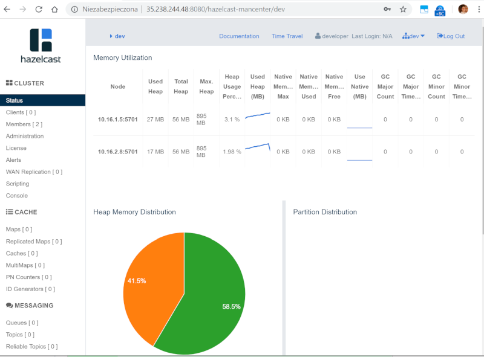

# Hazelcast Operator

Hazelcast Enterprise is packaged with [Operator Framework](https://github.com/operator-framework), which simplifies deployment on Kubernetes and OpenShift. This is a step-by-step guide how to deploy Hazelcast cluster together with Management Center on your Kubernetes or OpenShift cluster.

## Prerequisites

You must have one of the followings:
 * Kubernetes cluster (with admin rights) and the `kubectl` command configured (you may use [Minikube](https://kubernetes.io/docs/getting-started-guides/minikube/))
 * OpenShift cluster (with admin rights) and the `oc` command configured (you may use [Minishift](https://github.com/minishift/minishift))

## Kubernetes Deployment steps

Below are the steps to start a Hazelcast Enterprise cluster using Operator Framework. Note that the first 3 steps are usually performed only once for the Kubernetes cluster (by the cluster admin). The step 4 is performed each time you want to create a new Hazelcast cluster.

#### Step 1: Create RBAC

Run the following commands to configure the Operator permissions.

    kubectl apply -f rbac.yaml

#### Step 2: Create CRD (Custom Resource Definition)

To create the Hazelcast resource definition, run the following command.

    kubectl apply -f hazelcastcluster.crd.yaml

#### Step 3: Deploy Hazelcast Operator

Deploy Hazelcast Enterprise Operator with the following command.

    kubectl apply -f operator.yaml

#### Step 4: Start Hazelcast

Add a Secret within the Project that contains the Hazelcast License Key. If you don't have one, get a trial key from this [link](https://hazelcast.com/hazelcast-enterprise-download/trial/).

    kubectl create secret generic hz-license-key-secret --from-literal=key=LICENSE-KEY-HERE

Then, start Hazelcast cluster with the following command.

    kubectl apply -f hazelcast.yaml

Your Hazelcast Enterprise cluster (together with Management Center) should be created.

    $ kubectl get all
    NAME                                                                  READY   STATUS    RESTARTS   AGE
    pod/hazelcast-operator-79468c667-lz96b                                1/1     Running   0          6m
    pod/hz-9hwgko3mhi7u5esbwrelk0kj0-hazelcast-enterprise-0               1/1     Running   0          1m
    pod/hz-9hwgko3mhi7u5esbwrelk0kj0-hazelcast-enterprise-1               1/1     Running   0          54s
    pod/hz-9hwgko3mhi7u5esbwrelk0kj0-hazelcast-enterprise-mancentemqns5   1/1     Running   0          1m
    
    NAME                                                                  TYPE           CLUSTER-IP      EXTERNAL-IP      PORT(S)          AGE
    service/hz-9hwgko3mhi7u5esbwrelk0kj0-hazelcast-enterprise             ClusterIP      10.19.244.179   <none>           5701/TCP         1m
    service/hz-9hwgko3mhi7u5esbwrelk0kj0-hazelcast-enterprise-mancenter   LoadBalancer   10.19.240.2     35.184.181.188   8080:31383/TCP   1m
    service/kubernetes                                                    ClusterIP      10.19.240.1     <none>           443/TCP          39m
    
    NAME                                                                          DESIRED   CURRENT   UP-TO-DATE   AVAILABLE   AGE
    deployment.apps/hazelcast-operator                                            1         1         1            1           6m
    deployment.apps/hz-9hwgko3mhi7u5esbwrelk0kj0-hazelcast-enterprise-mancenter   1         1         1            1           1m
    
    NAME                                                                                     DESIRED   CURRENT   READY   AGE
    replicaset.apps/hazelcast-operator-79468c667                                             1         1         1       6m
    replicaset.apps/hz-9hwgko3mhi7u5esbwrelk0kj0-hazelcast-enterprise-mancenter-757cb7cd88   1         1         1       1m
    
    NAME                                                                 DESIRED   CURRENT   AGE
    statefulset.apps/hz-9hwgko3mhi7u5esbwrelk0kj0-hazelcast-enterprise   2         2         1m

**Note**: In `hazelcast.yaml` you can specify all parameters available in the [Hazelcast Enterprise Helm Chart](https://github.com/hazelcast/charts/tree/master/stable/hazelcast-enterprise).

To connect to Management Center, you can use `EXTERNAL-IP` and open your browser at: `http://<EXTERNAL-IP>:8080/hazelcast-mancenter`. If your Kubernetes environment does not have Load Balancer configured, then please use `NodePort` or `Ingress`.

## OpenShift Deployment steps

Below are the steps to start a Hazelcast Enterprise cluster using Operator Framework. Note that the first 3 steps are usually performed only once for the OpenShift cluster/project (usually by the cluster admin). The step 4 is performed each time you want to create a new Hazelcast cluster.

#### Step 0: Create project

To create a new project, run the following command.

    oc new-project hazelcast-operator
    
#### Step 1: Create RBAC

Run the following commands to configure the Operator permissions.

    # Additional step that may be needed
    oc adm policy add-scc-to-user hostnetwork -z default
     
    # Configure RBAC
    oc apply -f rbac.yaml

#### Step 2: Create CRD (Custom Resource Definition)

To create the Hazelcast resource definition, run the following command.

    oc apply -f hazelcastcluster.crd.yaml

#### Step 3: Deploy Hazelcast Operator

Deploy Hazelcast Enterprise Operator with the following command.

    oc apply -f operator.yaml

#### Step 4: Start Hazelcast

Add a Secret within the Project that contains the Hazelcast License Key. If you don't have one, get a trial key from this [link](https://hazelcast.com/hazelcast-enterprise-download/trial/).

    oc create secret generic hz-license-key-secret --from-literal=key=LICENSE-KEY-HERE

Then, start Hazelcast cluster with the following command.

    oc apply -f hazelcast.yaml

Your Hazelcast Enterprise cluster (together with Management Center) should be created.

    $ oc get all
    NAME                                                                    DESIRED   CURRENT   UP-TO-DATE   AVAILABLE   AGE
    deploy/hazelcast-operator                                               1         1         1            1           43m
    deploy/my-hz-ewvci29k7k5itktwi20m35e3b-hazelcast-enterprise-mancenter   1         1         1            1           40m
     
    NAME                                                                           DESIRED   CURRENT   READY     AGE
    rs/hazelcast-operator-9996757f6                                                1         1         1         43m
    rs/my-hz-ewvci29k7k5itktwi20m35e3b-hazelcast-enterprise-mancenter-6b9f957d9d   1         1         1         40m
     
    NAME                                                                DESIRED   CURRENT   AGE
    statefulsets/my-hz-ewvci29k7k5itktwi20m35e3b-hazelcast-enterprise   2         2         40m
     
    NAME                                                                 READY     STATUS    RESTARTS   AGE
    po/hazelcast-operator-9996757f6-6z7nq                                1/1       Running   0          43m
    po/my-hz-ewvci29k7k5itktwi20m35e3b-hazelcast-enterprise-0            1/1       Running   0          40m
    po/my-hz-ewvci29k7k5itktwi20m35e3b-hazelcast-enterprise-1            1/1       Running   0          39m
    po/my-hz-ewvci29k7k5itktwi20m35e3b-hazelcast-enterprise-mance8vtj4   1/1       Running   0          40m
     
    NAME                                                                 TYPE           CLUSTER-IP      EXTERNAL-IP                     PORT(S)          AGE
    svc/my-hz-ewvci29k7k5itktwi20m35e3b-hazelcast-enterprise             ClusterIP      172.30.87.11    <none>                          5701/TCP         40m
    svc/my-hz-ewvci29k7k5itktwi20m35e3b-hazelcast-enterprise-mancenter   LoadBalancer   172.30.78.141   172.29.250.171,172.29.250.171   8080:30658/TCP   40m

**Note**: In `hazelcast.yaml` you can specify all parameters available in the [Hazelcast Enterprise Helm Chart](https://github.com/hazelcast/charts/tree/master/stable/hazelcast-enterprise).

To connect to Management Center, you can use `EXTERNAL-IP` and open your browser at: `http://<EXTERNAL-IP>:8080/hazelcast-mancenter`. If your OpenShift environment does not have Load Balancer configured, then please use `NodePort` or `Ingress`.

## Troubleshooting

Kubernetes/OpenShift clusters are deployed in many different ways and you may encounter some of the following issues in some environments.

#### Invalid value runAsUser

Some of the Kubernetes/OpenShift environments may have the restriction on the User ID used for the container.

    $ oc describe statefulsets/my-hz-ewvci29k7k5itktwi20m35e3b-hazelcast-enterprise
    Warning  FailedCreate  28m (x13 over 28m)  statefulset-controller  create Pod my-hz-a2rqj3ai7p1ircbl9u7rr5riv-hazelcast-enterprise-0 in StatefulSet my-hz-a2rqj3ai7p1i
    rcbl9u7rr5riv-hazelcast-enterprise failed error: pods "my-hz-a2rqj3ai7p1ircbl9u7rr5riv-hazelcast-enterprise-0" is forbidden: unable to validate against any security con
    text constraint: [spec.containers[0].securityContext.securityContext.runAsUser: Invalid value: 65534: must be in the ranges: [1000170000, 1000179999]]
    
Then, please update your `hazelcast.yaml` with the valid `runAsUser` and `fsGroup` values.

    apiVersion: hazelcast.com/v1alpha1
    kind: Hazelcast
    metadata:
      name: hz
    spec:
      image:
        tag: "3.11.2"
      hazelcast:
        licenseKeySecretName: "hz-license-key-secret"
      securityContext:
        runAsUser: 1000160000
        fsGroup: 1000160000

#### Invalid value: must be no more than 63 characters

In the sample `hazelcast.yaml`, the name of the Hazelcast cluster is `hz`. If you make this value longer, you may encounter the following error.

    oc describe statefulset.apps/my-hazelcast-2esqhajupdg5002uqwgoc8jnj-hazelcast-enterprise
     
    .......Invalid value: "my-hazelcast-2esqhajupdg5002uqwgoc8jnj-hazelcast-enterprise-74cf94b5": must be no more than 63 characters
    
This is the issue of the Operator itself, so there is not better solution for now than giving your cluster a short name.

