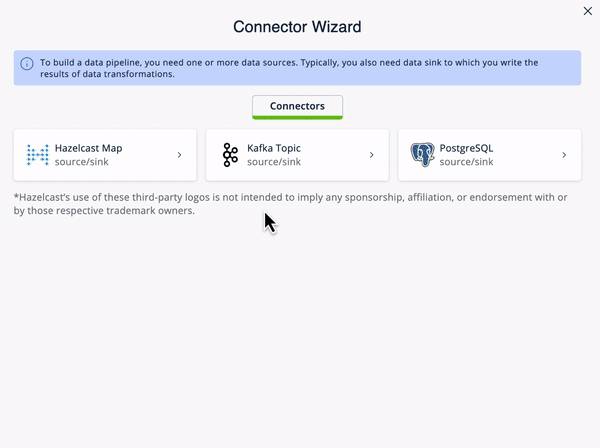

This tutorial provides detailed information and instruction for the
Airline Connections demo built in to Viridian Trial.

# Context

This demo/tutorial creates an application that uses streaming data about
flight arrival and departure times, and correlates it with stored data
about connecting flights, airport gates, and gate-to-gate travel times
to determine whether there’s enough time to make a particular flight
connection.

Specifically, you will learn how to \* Connect to external data sources
and sinks \* Use SQL to search and display streaming data \* Use SQL
import data from an external database \* Configure late event handling
for streaming data \* Join streaming and stored data to generate
continually-updated results

When you launch the demo in Viridian, you may see a step-by-step guide
appear in conjunction with the demo. This tutorial is designed to
supplement that guide, providing additional context and detail as well
as links to reference materials.

# Before you Begin

Before starting this tutorial, make sure that you meet the following
prerequisites:

-   You have a running cluster in Viridian Trial

-   You’ve downloaded and connected the Command Line Client to your
    cluster

-   For the client, you will need Java 11 or greater

-   (Optional) Java IDE to view client code

# Step 1. Review What’s Already Set Up

Begin by selecting the Airline Connections demo from the Viridian
dashboard. This launches a pre-set configuration and opens the SQL
browser window.

The pre-set configuration includes the following elements:

-   Connections to a Kafka server and a Postgres database

-   Mappings for streaming data

-   Mappings for IMaps to hold contextual data

-   Data imported from Postgres to local IMaps

The best way to build connections to external sources is to use the
Connection Wizard. The wizard walks you through the steps of connecting
to the external data source, then setting up the mapping so that the
external data is available to the Hazelcast SQL engine

The SQL code for each element is below.

Mappings for streaming data: \`\`\`sql CREATE OR REPLACE MAPPING
"arrivals" --topic name from Kafka EXTERNAL NAME
"viridiantrial.flights.arrivals" ( --fields in topic event\_time
timestamp with time zone, "day" date, flight varchar, airport varchar,
arrival\_gate varchar, arrival\_time timestamp ) DATA CONNECTION
"ViridianTrialKafka" OPTIONS ( *keyFormat* = *varchar*, *valueFormat* =
*json-flat* ); \`\`\` \`\`\`sql CREATE OR REPLACE MAPPING "departures"
--topic name in Kafka EXTERNAL NAME "viridiantrial.flights.departures" (
--fields in topic event\_time timestamp with time zone, "day" date,
flight varchar, airport varchar, departure\_gate varchar,
departure\_time timestamp ) DATA CONNECTION "ViridianTrialKafka" OPTIONS
( *keyFormat* = *varchar*, *valueFormat* = *json-flat* ); \`\`\`
Mappings for data in Postgres: \`\`\`sql CREATE OR REPLACE MAPPING
"connections" --name of data store in Postgres EXTERNAL NAME
"public"."connections" ( arriving\_flight varchar, departing\_flight
varchar ) DATA CONNECTION "ViridianTrialPostgres"; \`\`\` \`\`\`sql
CREATE OR REPLACE MAPPING "minimum\_connection\_times" EXTERNAL NAME
"public"."minimum\_connection\_times" ( airport varchar,
arrival\_terminal varchar, departure\_terminal varchar, minutes integer
) DATA CONNECTION "ViridianTrialPostgres"; \`\`\` Local storage for data
from Postgres: \`\`\`sql CREATE OR REPLACE MAPPING local\_mct( airport
varchar, arrival\_terminal varchar, departure\_terminal varchar, minutes
integer ) Type IMap OPTIONS ( *keyFormat* = *varchar*, *valueFormat* =
*json-flat* ); \`\`\` \`\`\`sql CREATE OR REPLACE MAPPING
local\_connections( arriving\_flight varchar, departing\_flight varchar
) Type IMap OPTIONS ( *keyFormat* = *varchar*, *valueFormat* =
*json-flat* ); \`\`\` Import Postgres data into local storage: \`\`\`sql
--In order to ensure a clean write, we make sure the map is empty DELETE
FROM local\_mct; --now we copy all the data from the external store
INSERT INTO local\_mct(*key, airport, arrival\_terminal,
departure\_terminal, minutes) SELECT
airport||arrival\_terminal||departure\_terminal, airport,
arrival\_terminal, departure\_terminal, minutes FROM
minimum\_connection\_times; \`\`\` \`\`\`sql DELETE FROM
local\_connections; INSERT INTO local\_connections(*key,
arriving\_flight, departing\_flight) SELECT arriving\_flight ||
departing\_flight, arriving\_flight, departing\_flight FROM
"connections"; \`\`\`

Why are we copying the Postgres data into local storage? We are using
the data to enrich real-time streaming data. Having the data co-located
means there’s no read delay in accessing the enriching data.

IMap to store output of JOIN job: \`\`\`sql CREATE OR REPLACE MAPPING
live\_connections( arriving\_flight varchar, arrival\_gate varchar,
arrival\_time timestamp, departing\_flight varchar, departure\_gate
varchar, departure\_time timestamp, connection\_minutes integer, mct
integer, connection\_status varchar ) Type IMap OPTIONS ( *keyFormat* =
*varchar*, *valueFormat* = *json-flat* ); \`\`\` == Step 2. Build and
Test JOIN Now that the storage framework and streaming maps are set up,
now we can look at the actual data streams.

1.  Examine the data in the `arrivals` and `departures` streams.

    \`\`\`sql SELECT \* FROM arrivals; \`\`\`

    \`\`\`sql SELECT \* FROM departures; \`\`\` . When you are dealing
    with streaming data, you need to accommodate the possibility that
    data will arrive late or not at all. You do not want these late or
    missing events to slow down your jobs. In order to prevent this, you
    will use an IMPOSE\_ORDER statement to define a threshold (lag) for
    how late events can be before they are ignored.

    Because you will be using this ordered data in a subsequent JOIN
    statement, you need to create a view that holds the ordered data. In
    this demo, both the arrivals and departures data needs to be
    ordered. The departures data is already done, so run this code to
    impose order on the arrivals data.

    \`\`\`sql CREATE OR REPLACE VIEW arrivals\_ordered AS SELECT \* FROM
    TABLE ( IMPOSE\_ORDER( TABLE arrivals, DESCRIPTOR(event\_time),
    INTERVAL *1* HOUR ) ); \`\`\`

# Step 3. Command Line Client setup

If you have not already set up the Command Line Client (CLC), you need
to do so now. If you already have it set up, skip to [Step 4. Submit
Job](#Submit-Job).

1.  Click on the Dashboard icon on the left of your screen.

2.  Select the CLI icon.

3.  Follow the steps

# Step 4. Submit Job

# Step 4. Download and Run Client

# Summary

# See Also
