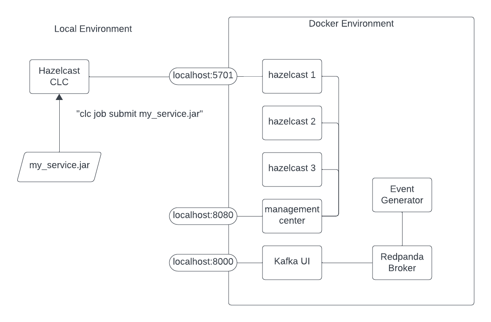

# Overview 

The purpose of this lab is to show you how to implement event-driven microservices using the Hazelcast platform.

Event-driven microservices have the following basic properties:
- they implement a cohesive "chunk" of business functionality 
- they are deployable components
- they consume and emit events 

_Pipelines_, a part of the Hazelcast platform, exhibit all 3 characteristics. In other words, Pipelines are 
how Hazelcast implements event-driven microservices.  In this lab, you will learn:
- [ ] how to implement an event-driven microservice by writing a Pipeline 
- [ ] how to deploy your service to the Hazelcast platform
- [ ] how to scale your service 
- [ ] how to update your service while it is running 
- [ ] how to take advantage of the fast data store that is built in to the platform
- [ ] how to incorporate python code into your service 
- [ ] as a bonus, you will learn how traditional REST microservices can be implemented with Hazelcast Pipelines

Let's get started ...

# Prerequisites 

You will need a development laptop with the following installed:
- Docker Desktop
- A functional Java IDE
- Maven
- __Hazelcast Command Line Client (CLC)__

To install Hazelcast CLC, see: https://docs.hazelcast.com/clc/latest/install-clc

# Overview of the Environment

Most of the components of this lab run within an isolated Docker environment. To allow 
you to interact with the components from outside the Docker environment some 
components are exposed on localhost ports.  For example, when you run CLC it will 
connect to one of the Hazelcast instances via `localhost:5701`.  The diagram below 
should help to clarify the situations.



# Lab 0: Verify the environment

To start the lab environment, run the following from a command line:  
> `docker compose up -d`

Let's connect the Hazelcast CLI to the Hazelcast instance running in docker.

> ```
> clc config add docker cluster.name=dev cluster.address=localhost:5701
>  OK Created the configuration at: /Users/rmay/.hazelcast/configs/docker/config.yaml
> ```

This command saves the cluster connection information in a configuration file as shown 
in the output.  In this case, "docker" is the name of the configuration we have 
created.  In subsequent commands, use the "-c" flag to designate a named configuration.
Verify your new configuration is valid using the following command.

> ```
> clc -c docker  job list
> OK No jobs found.
> ```

Use the Kafka UI at  http://localhost:8000 to inspect the messages in the "transactions"
topic.


You can also access the Hazelcast Management Center at http://localhost:8080 


# Lab 1: Deploy a Service 

For this lab the pipeline has already been built for you.  It simply reads every 
message from the "transactions" topic and publishes an approval on the "approvals" 
topic.  It does no fraud detection at all!


Check out the code in `hazelcast.platform.labs.payments.FraudPipeline` 

Build and deploy the Pipeline. From a command prompt in the project root directory run:
```shell
mcn clean install
clc -c docker  job submit fraud-pipelines/target/fraud-pipelines-1.0-SNAPSHOT.jar redpanda:9092 transactions approvals --class hazelcast.platform.labs.payments.FraudPipeline
```

To verify it worked, check the "Jobs" section of Hazelcast Management Center (http://localhost:8080) 
and also use the Kafka UI (http://localhost:8000) to see that there are messages in the "approvals" topic.

You can also use CLC to check the status of the job:
```shell
clc -c docker  job list
 Job ID              | Name          | Status  | Submitted           | Completed
 0b6d-f591-2180-0001 | Fraud Checker | RUNNING | 2024-03-22 11:50:01 | -
```

WIERD PROBLEM:
Here is where things go wrong. Stop the event generator (`docker compose stop event-generator`).  

Observations
1. The number of messages out (in the "approvals" topic) should match the number of messages in (from the "transactions" topic) but there are actually more messages out. 
2. Even with the event generator stopped, the "total in" will continue to rise even though nothing is being written to the topic 
   at the same time, the total out will remain steady. The total out as reporte by MC matches the number of items in the input topic, "transactions"


