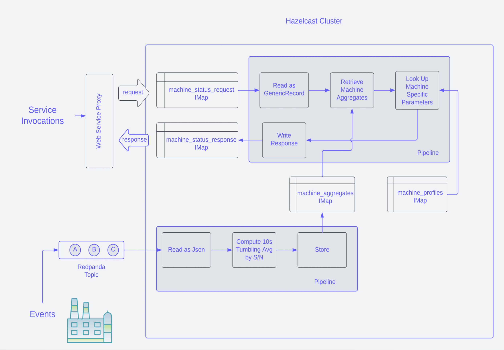
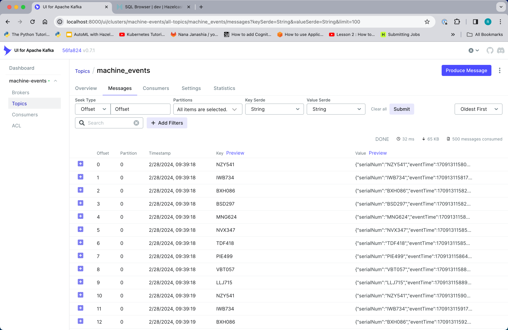
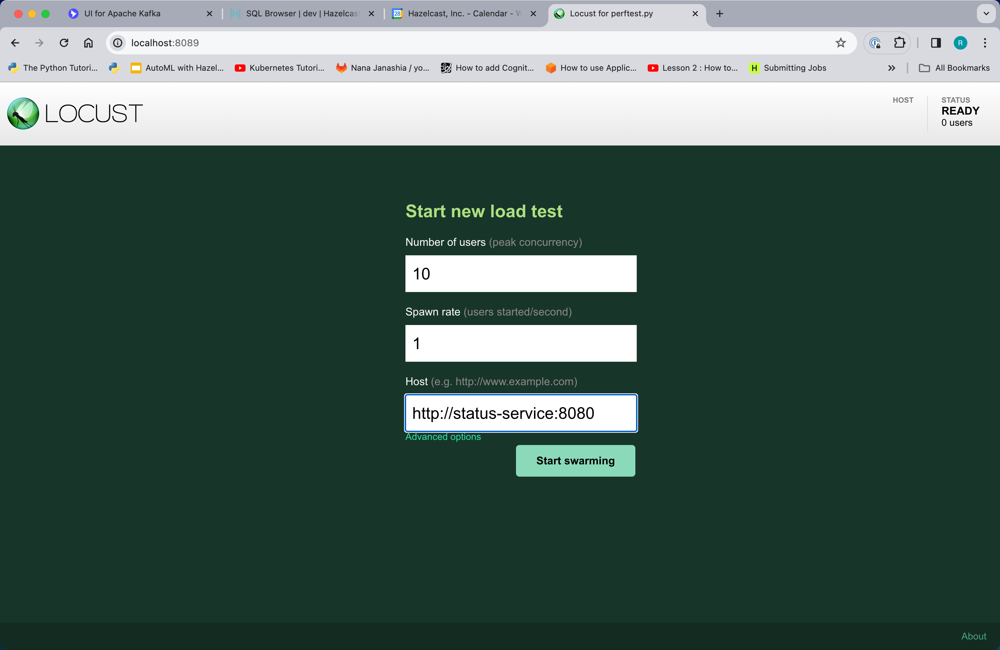
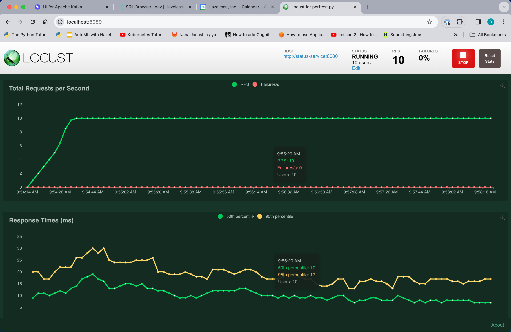

# Overview

This demonstration highlights how Hazelcast Pipelines can be used to 
implement event-driven microservices and conventional request/response microservices.

For the latter, it relies on https://github.com/hazelcast-guides/spring-hazelcast-pipeline-dispatcher, which 
is incorporated as a submodule.

This demo relates to processing telemetry from a hypothetical machine shop or 
factory. There are 2 services (depicted as gray boxes in the blueprint).  One is event-driven. 
It processes telemetry events from a Redpanda topic , computes aggregates, and saves the result 
in a Hazelcast IMap.  As events come in, the Pipeline updates the IMap with the 
most recent information for each machine.

The second service is request/response based.  It implements a machine status 
service.  When requested, the current status for a specific machine 
is read and combined with machine profile information (stored in a Hazelcast IMap)
, returning the latest status including a green/orange/red classification. The
request and response are mediated by Hazelcast IMaps.  For details of the 
dispatching mechanism, see the _Spring Hazelcast Pipeline Dispatcher_ mentioned 
above.



# Prerequisites

- Docker Desktop
- Maven
- Postman

# Walk Through

First, since this project uses submodules, run the following to pull the 
submodule code down.
```shell
git submodule init
git submodule update
```

Then build everything.  Be sure to `mvn install`, not just `mvn package`
```shell
mvn clean install
```

Now start the demo with a 2 node Hazelcast cluster
```shell
docker compose up -d --scale hz=2
```

Access the Hazelcast Management Center at http://localhost:8080.


You can use the SQL Browser to view `machine_profiles` and the entries that 
are written by the aggregation pipeline into the `machine_status_summary` map. 

Browse the Redpanda Topic: http://localhost:8000 


The machine status REST service is exposed at http://localhost:8888.  Using 
one of the serial numbers from the `machine_profiles` map, you can issue a 
request using Postman (or any other REST client), as shown below.


In addition, you can start a performance test on the REST service 
using Locust.  Navigate to http://localhost:8089 and fill out 
the dialog as shown below.  



Hit the "Start Swarming" button.  On the following screen, select "charts".
You will see a graph of throughput and response times.  Leave this 
running while you update the status service to demonstrate that there is 
no interruption of service when the status service back end is updated.



2 Pipelines for the status service are provided so that 
blue/green deployment can be demonstrated.  Initially, the pipeline 
that is deployed does not do any lookup on the `machine_profiles` map
so the response will not contain a red/orange/green status.  You can verify 
this with Postman.

To deploy the second implementation of the status service, run
```shell
docker compose run submit-status-service-job-2
```

You can use the Management Center to verify that the new job has been 
deployed, along with a new map, `machinestatus_v2_request`.  However,
there will be no requests flowing through the new pipeline.  To send 
request to the new pipeline, you will need to update the routing configuration.

The following command will cause the routing configuration to be written 
to `routes.json`.  

```shell
docker compose run dump-routing-config
```

`routes.json` is shown below.

```json
{
  "machinestatus" : {
    "v1" : 1,
    "v2" : 0
  }
}
```
The `machinestatus` key indicates the routing configuration for the 
machine status service.  Within that, there is a dictionary of versions 
and weights.  Weights are relative and do not have to add to 1.  

To update the routing configuration and send all of the request to the 
second implementation of the service, run

```json
docker compose run load-routing-config-2
```

You should now see that all traffic is going to the second implementation.
You  can also use Postman to verify that the red/orange/green status is 
now being populated. Also, check Locust at http://localhost:8089 to verify
that there were no failures or slow requests.

Using the routing configuration, you can direct an arbitrary percentage of 
traffic to each implementation.


